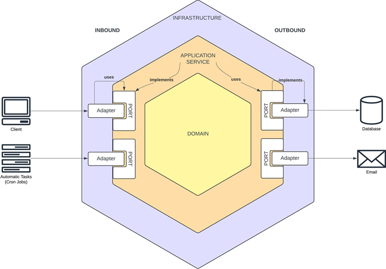
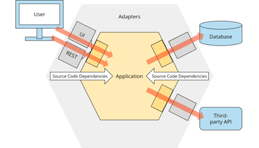

# 🏛️ Arquitectura Hexagonal (Puertos y Adaptadores)

Marco teórico elaborado por Martín Díaz (02/2026) utilizando IAs (ChatGPT, Copilot, Gemini, Claude).

---

## 📚 ¿Qué es la Arquitectura Hexagonal?

La `Arquitectura Hexagonal`, también conocida como `Arquitectura de Puertos y Adaptadores`, fue propuesta por
`Alistair Cockburn` en 2005. Su objetivo principal es **aislar completamente la lógica de negocio de los detalles
técnicos externos** (bases de datos, frameworks, APIs externas, interfaces de usuario, etc.).

> 💡 `Idea central`: Tu lógica de negocio no debería saber si está siendo llamada por una API REST, un mensaje de cola,
> una interfaz gráfica o un test unitario. Tampoco debería saber si los datos se guardan en `PostgreSQL`, `MongoDB`
> o en memoria.

La arquitectura establece que:

- El `núcleo` de la aplicación `(dominio + aplicación)` es completamente `independiente` del mundo exterior.
- La comunicación con el exterior se hace a través de `interfaces bien definidas` llamadas `Puertos`.
- Los detalles técnicos externos se implementan como `Adaptadores` que cumplen esas interfaces.

## 🔷 ¿Por qué se llama "Hexagonal"?

El hexágono es solo una metáfora visual, `no tiene un significado matemático especial`. Cockburn lo eligió simplemente
porque:

- Permite dibujar múltiples "lados" (entradas y salidas) de manera simétrica.
- Visualmente, representa que la aplicación puede tener múltiples formas de entrada y salida al mismo nivel de
  importancia.
- A diferencia de la arquitectura en capas (que sugiere una jerarquía vertical), el hexágono sugiere igualdad entre los
  adaptadores.

No significa que existan exactamente 6 lados técnicos. Lo importante es el concepto:
> 💡 El núcleo está en el centro y todo lo externo se conecta a través de puertos.

Imagen extraída
de [Construyendo una RESTful API con Spring Boot: Integración de DDD y Arquitectura Hexagonal (Juan Negrin)](https://medium.com/@juannegrin/construyendo-una-restful-api-con-spring-boot-integraci%C3%B3n-de-ddd-y-arquitectura-hexagonal-af824a3a4d05)  


## 🔑 Conceptos Clave

### 🟣 Dominio

El `dominio` es el corazón de tu aplicación. Contiene las reglas de negocio puras, sin ninguna dependencia de
frameworks, bases de datos ni librerías externas.

> 📌 `Ejemplo`: En un sistema bancario, la regla `"no se puede transferir más dinero del que hay en cuenta"` es lógica
> de dominio pura. No importa si viene de una REST API o de un batch nocturno.

### 🔵 Puertos

- Los `puertos` son `interfaces` (contratos) que definen cómo se comunica el dominio con el mundo exterior. Son
  simplemente interfaces de `Java/Kotlin/etc`. que viven en la capa de dominio o aplicación.
- Definen `qué` quiere hacer la aplicación, pero no `cómo` se hace.

Existen dos tipos:

| Tipo                | También llamado              | Dirección     | ¿Quién lo define?  | ¿Quién lo implementa?            |
|---------------------|------------------------------|---------------|--------------------|----------------------------------|
| `Puerto de Entrada` | Driving Port / Inbound Port  | Hacia adentro | Capa de Aplicación | El propio caso de uso (Use Case) |
| `Puerto de Salida`  | Driven Port  / Outbound Port | Hacia afuera  | Capa de Aplicación | Adaptadores de Infraestructura   |

#### Puerto de Entrada — Ejemplo:

````java
// Puerto que define lo que puede hacer el mundo exterior con nuestros casos de uso
public interface CreateUserUseCase {
    UserResponse execute(CreateUserCommand command);
}
````

#### Puerto de Salida — Ejemplo:

````java
// Puerto que define lo que necesita el dominio del mundo exterior (ej: persistencia)
public interface UserRepository {
    Optional<User> findById(Long userId);

    User save(User user);
}
````

> 💡 `Clave`: Los puertos de salida son interfaces que viven en la capa de `aplicación/dominio`, pero su implementación
> vive en `infraestructura`. Esto es la `inversión de dependencias (DIP)`.

### 🟢 Adaptadores

Los `adaptadores` son las `implementaciones concretas` que conectan el mundo exterior con los puertos.
Hay dos tipos que corresponden a los puertos:

| Tipo                   | También llamado                   | Ejemplo                                        |
|------------------------|-----------------------------------|------------------------------------------------|
| `Adaptador de Entrada` | Driving Adapter / Inbound Adapter | Controlador REST, Consumidor Kafka, Scheduler  |
| `Adaptador de Salida`  | Driven Adapter / Outbound Adapter | Repositorio JPA, Cliente HTTP, Sender de Email |

#### Adaptador de Entrada — Ejemplo:

````java
// El controlador REST es un adaptador de entrada
@RestController
public class UserController {

    private final CreateUserUseCase createUserUseCase; // Usa el puerto de entrada

    public UserController(CreateUserUseCase createUserUseCase) {
        this.createUserUseCase = createUserUseCase;
    }

    @PostMapping("/users")
    public ResponseEntity<UserResponse> create(@RequestBody CreateUserRequest request) {
        CreateUserCommand command = UserMapper.toCommand(request);
        return ResponseEntity.ok(createUserUseCase.execute(command));
    }
}
````

#### Adaptador de Salida — Ejemplo:

````java
// La implementación JPA es un adaptador de salida que implementa el puerto UserRepository
@Repository
public class UserJpaAdapter implements UserRepository {

    private final UserJpaRepository jpaRepository;

    @Override
    public User save(User user) {
        UserEntity entity = UserMapper.toEntity(user);
        return UserMapper.toDomain(jpaRepository.save(entity));
    }
}
````

## 🧱 Las 3 Capas de la Arquitectura Hexagonal

### 🟤 Capa de Dominio

Es el núcleo absoluto. No tiene ninguna dependencia externa. No conoce Spring, JPA, ni nada de infraestructura.

#### ¿Qué va aquí?

| Elemento                  | Descripción                                                 | Ejemplo                                               |
|---------------------------|-------------------------------------------------------------|-------------------------------------------------------|
| Entidades de Dominio      | Objetos con identidad y ciclo de vida (sin anotaciones JPA) | `User`, `Account`, `Policy`                           |
| Value Objects             | Objetos inmutables, sin identidad, definidos por su valor   | `Email`, `Money`, `UserId`, `IBAN`                    |
| Agregados (Aggregates)    | Grupos de entidades tratadas como una unidad                | `Order` con sus `OrderItems`                          |
| Excepciones de Dominio    | Excepciones propias del negocio                             | `InsufficientFundsException`, `UserNotFoundException` |
| Eventos de Dominio        | Hechos relevantes que ocurren en el negocio                 | `UserCreatedEvent`, `PaymentProcessedEvent`           |
| Interfaces de Repositorio | Contratos de persistencia (puertos de salida)               | `UserRepository`, `AccountRepository`                 |
| Servicios de Dominio      | Lógica que no pertenece a una sola entidad                  | `FundsTransferService`, `RiskCalculatorService`       |
| Enumeraciones de Dominio  | Estados y tipos de negocio                                  | `UserStatus`, `AccountType`, `TransactionType`        |
| Reglas de Negocio         | Invariantes del dominio                                     | Validaciones dentro de las entidades                  |
| Factories                 | Creación compleja de entidades                              | `UserFactory`, `LoanFactory`                          |

#### Ejemplo de Entidad de Dominio:

````java
public class Account {
    private final AccountId id;
    private Money balance;
    private AccountStatus status;

    // Las reglas de negocio viven aquí
    public void withdraw(Money amount) {
        if (amount.isGreaterThan(this.balance)) {
            throw new InsufficientFundsException("Saldo insuficiente");
        }
        if (this.status == AccountStatus.BLOCKED) {
            throw new AccountBlockedException("La cuenta está bloqueada");
        }
        this.balance = this.balance.subtract(amount);
    }
}
````

#### Ejemplo de Value Object:

````java
public record Money(BigDecimal amount, Currency currency) {
    public Money {
        if (amount.compareTo(BigDecimal.ZERO) < 0) {
            throw new IllegalArgumentException("El monto no puede ser negativo");
        }
    }

    public boolean isGreaterThan(Money other) {
        return this.amount.compareTo(other.amount) > 0;
    }

    public Money subtract(Money other) {
        return new Money(this.amount.subtract(other.amount), this.currency);
    }
}
````

### 🔵 Capa de Aplicación

Orquesta los casos de uso. `Coordina las entidades de dominio` y usa los puertos para comunicarse con el exterior.
`Conoce el dominio` pero `no conoce los detalles de infraestructura`.

#### ¿Qué va aquí?

| Elemento                 | Descripción                                              | Ejemplo                                            |
|--------------------------|----------------------------------------------------------|----------------------------------------------------|
| Casos de Uso (Use Cases) | Cada operación de negocio que ofrece el sistema          | `CreateUserUseCase`, `TransferFundsUseCase`        |
| Puertos de Entrada       | Interfaces que los adaptadores de entrada usan           | `CreateUserUseCase` (la interfaz)                  |
| Puertos de Salida        | Interfaces que los adaptadores de salida implementan     | `UserRepository`, `NotificationPort`               |
| Servicios de Aplicación  | Implementan los casos de uso, orquestan el dominio       | `CreateUserService` implements `CreateUserUseCase` |
| DTOs/Commands            | Objetos de transferencia de datos de entrada             | `CreateUserCommand`, `TransferFundsCommand`        |
| Responses                | Objetos de respuesta de los casos de uso                 | `UserResponse`, `TransferResponse`                 |
| Mappers de Aplicación    | Convierten entre Commands/Responses y objetos de dominio | `UserApplicationMapper`                            |
| Validadores              | Validaciones de la capa de aplicación                    | `CreateUserCommandValidator`                       |
| Manejadores de Eventos   | Reaccionan a eventos de dominio                          | `UserCreatedEventHandler`                          |
| Transacciones            | Gestión de transacciones (usando anotaciones)            | `@Transactional` en el servicio                    |

#### Ejemplo de Caso de Uso:

````java
// Puerto de Entrada
public interface CreateUserUseCase {
    UserResponse execute(CreateUserCommand command);
}

// Servicio de Aplicación (implementa el caso de uso)
@Service
@Transactional
public class CreateUserService implements CreateUserUseCase {

    private final UserRepository userRepository;         // Puerto de Salida
    private final NotificationPort notificationPort;     // Puerto de Salida

    @Override
    public UserResponse execute(CreateUserCommand command) {
        // 1. Validar que el email no existe
        userRepository.findByEmail(command.email())
                .ifPresent(u -> {
                    throw new EmailAlreadyExistsException(command.email());
                });

        // 2. Crear la entidad de dominio
        User user = User.create(command.name(), command.email(), command.documentNumber());

        // 3. Persistir
        User savedUser = userRepository.save(user);

        // 4. Notificar
        notificationPort.sendWelcomeEmail(savedUser.getEmail().value());

        // 5. Retornar respuesta
        return UserApplicationMapper.toResponse(savedUser);
    }
}
````

#### Ejemplo de Command (DTO de entrada):

````java
public record CreateUserCommand(String name,
                                String email,
                                String documentNumber) {
}
````

### ⚖️ ¿Dónde debería ir `@Transactional` en Arquitectura Hexagonal?

Si la capa de `Aplicación` no debe saber nada de frameworks, meter un `@Transactional` de `Spring` ahí es,
técnicamente, "contaminar" el purismo de la arquitectura. Aquí existen dos posturas, ambas usadas en la industria:

#### 📌 Postura A — `@Transactional` en la capa de Aplicación (El más común)

Este es el enfoque `pragmático` que usan la mayoría de equipos en empresas reales con `Spring Boot`.
El razonamiento es:

> *"La gestión de transacciones es una preocupación de `aplicación`, `no de infraestructura`. El servicio de aplicación
> es quien sabe qué operaciones deben ser atómicas. `@Transactional` de Spring es tan estándar y ubicuo que el costo
> del acoplamiento es aceptable."*

Es decir, lo aceptan como una `concesión pragmática`. En el 90% de proyectos Spring Boot empresariales vas a ver
`@Transactional` en el servicio de aplicación.

#### 📌 Postura B — `@Transactional` en la capa de Infraestructura (Pureza Arquitectónica Total)

Este es el enfoque `purista`, y técnicamente es el más correcto si sigues la arquitectura hexagonal al pie de la letra.
La lógica es la siguiente:

> *"Si mañana cambio Spring Boot por Quarkus, esa anotación se rompe. El servicio de aplicación no debería saber
> nada de Spring."*

En este enfoque, existen varias estrategias:

- `Estrategia 1` — El adaptador de salida gestiona la transacción:
  ````java
  // Infraestructura — el adaptador maneja la transacción
  @Repository
  public class UserJpaAdapter implements UserRepository {
  
      @Transactional  // ← aquí, en infraestructura
      @Override
      public User save(User user) {
          /*...*/
      }
  }
  ````

- `Estrategia 2` — Un puerto de transacción explícito. Defines un puerto de salida que abstrae el concepto de
  transacción:
  ````java
  // Aplicación — puerto de salida (solo una interfaz, sin Spring)
  public interface TransactionPort {
      <T> T executeInTransaction(Supplier<T> operation);
  }
  
  // El servicio de aplicación lo usa sin saber que es Spring
  public class CreateUserService implements CreateUserUseCase {
  
      private final UserRepository userRepository;
      private final TransactionPort transactionPort; // ← abstracción
  
      @Override
      public UserResponse execute(CreateUserCommand command) {
          return transactionPort.executeInTransaction(() -> {
              User user = User.create(command.name(), command.email());
              return UserApplicationMapper.toResponse(userRepository.save(user));
          });
      }
  }
  
  // Infraestructura — implementa el puerto usando Spring
  @Component
  public class SpringTransactionAdapter implements TransactionPort {
  
      @Transactional  // ← Spring vive aquí, en infraestructura
      @Override
      public <T> T executeInTransaction(Supplier<T> operation) {
          return operation.get();
      }
  }
  ````

Con esto, si mañana cambias a Quarkus, solo cambias `SpringTransactionAdapter` por `QuarkusTransactionAdapter`.
El servicio de aplicación no se toca.

#### 📝 ¿Qué se usa en la vida real?

Siendo honesto, así se distribuye en la industria:

| Enfoque                                      | Cuándo se usa                                                                                                                      |
|----------------------------------------------|------------------------------------------------------------------------------------------------------------------------------------|
| `@Transactional` en el Service de Aplicación | La gran mayoría de proyectos empresariales con Spring Boot. Se acepta el acoplamiento como trade-off.                              |
| Puerto de Transacción explícito              | Proyectos que necesitan independencia real de framework, librerías multi-módulo, o cuando hay requisito explícito de portabilidad. |
| `@Transactional` en el Adaptador JPA         | Cuando las transacciones son simples y acotadas a una sola operación de persistencia.                                              |

### 🎯 Recomendación

Tu intuición es correcta desde la teoría pura. En la práctica, la mayoría de equipos usan la `Postura A` aceptando
ese acoplamiento como un trade-off razonable, porque cambiar de `Spring Boot` es algo que ocurre rarísimas veces.

Sin embargo, si quieres ser purista o si el proyecto lo justifica, la `Estrategia 2` (puerto de transacción) es la
forma más elegante y correcta de resolverlo.

En la `Fase 2`, cuando hagamos el proyecto, se mostrará el enfoque más usado en empresas reales
(con `@Transactional` en la capa de `aplicación`) pero dejando clara esta nota para saber exactamente qué
trade-off se está tomando y por qué.

### 🔴 Capa de Infraestructura

Contiene todos los `detalles técnicos`. Aquí viven los adaptadores. Esta capa `conoce todo`: conoce Spring, JPA, Kafka,
HTTP, etc. Pero `el dominio no la conoce a ella`.

#### ¿Qué va aquí?

| Elemento                   | Descripción                                         | Ejemplo                                      |
|----------------------------|-----------------------------------------------------|----------------------------------------------|
| Controladores REST         | Adaptadores de entrada HTTP                         | `UserController`, `AccountController`        |
| Consumidores de Mensajería | Adaptadores de entrada de colas                     | `KafkaUserConsumer`, `RabbitMQConsumer`      |
| Schedulers / Jobs          | Adaptadores de entrada programados                  | `ReportScheduler`, `CleanupJob`              |
| Repositorios JPA           | Interfaces de Spring Data JPA                       | `UserJpaRepository` extends `JpaRepository`  |
| Adaptadores de Repositorio | Implementan los puertos de salida usando JPA        | `UserJpaAdapter` implements `UserRepository` |
| Entidades JPA              | Entidades de base de datos (≠ entidades de dominio) | `UserEntity`, `AccountEntity`                |
| Clientes HTTP (RestClient) | Adaptadores para consumir APIs externas             | `PaymentGatewayClient`, `NotificationClient` |
| Productores de mensajería  | Envían mensajes a colas/topics                      | `KafkaEventProducer`                         |
| Configuraciones            | Beans de Spring, configuración de seguridad         | `SecurityConfig`, `RestClientConfig`         |
| Mappers de Infraestructura | Convierten entre entidades JPA y dominio            | `UserInfrastructureMapper`                   |
| Excepciones Handler        | Manejo global de excepciones HTTP                   | `GlobalExceptionHandler`                     |
| Migraciones de BD          | Scripts de Flyway/Liquibase                         | `V1__create_users_table.sql`                 |
| Implementaciones de Caché  | Redis, EHCache, etc.                                | `RedisCacheAdapter`                          |

#### Ejemplo de Adaptador de Repositorio:

````java

@Repository
public class UserJpaAdapter implements UserRepository {

    private final UserJpaRepository jpaRepository;
    private final UserInfrastructureMapper mapper;

    @Override
    public User save(User user) {
        UserEntity entity = mapper.toEntity(user);
        UserEntity savedEntity = jpaRepository.save(entity);
        return mapper.toDomain(savedEntity);
    }

    @Override
    public Optional<User> findById(UserId id) {
        return jpaRepository.findById(id.value())
                .map(mapper::toDomain);
    }
}
````

#### Ejemplo de Entidad JPA (≠ Entidad de Dominio):

````java

@Entity
@Table(name = "users")
public class UserEntity {
    @Id
    private UUID id;
    private String name;
    private String email;
    private String documentNumber;
    private String status;
    private LocalDateTime createdAt;
    private LocalDateTime updatedAt;
}
````

> 💡 `Nota crítica`: La entidad JPA (`UserEntity`) y la entidad de dominio (`User`) son objetos distintos.
> El mapper de infraestructura convierte entre ambas. Esto asegura que JPA no "contamine" el dominio.

## 🔄 Regla de la dependencia

`Regla de dependencia`. Esta regla establece que todas las dependencias del código fuente solo pueden apuntar
desde fuera hacia dentro, es decir, en dirección al hexágono de la aplicación:

Imagen extraída
de [Hexagonal Architecture – What Is It? Why Use It?(Sven Woltmann)](https://www.happycoders.eu/software-craftsmanship/hexagonal-architecture/)  


> ⚠️ `Regla de Oro`:
> Las dependencias siempre apuntan desde afuera hacia adentro (hacia el núcleo del sistema).
>
> - La capa de `infraestructura`, depende de las capas internas (`aplicación`, `dominio`).
> - La capa de `aplicación`, depende de la capa de `dominio`.
> - La capa de `dominio` (núcleo del negocio) no depende de nadie, solo se conoce a sí mismo.

`Dirección Única`: Las dependencias se dirigen hacia el centro:
> `Infraestructura -> Aplicación -> Dominio`.

Esta regla proporciona la posibilidad de cambiar elementos de nuestras capas exteriores sin afectar las internas. Por
esta razón, tiene más sentido que los aspectos con mayor variabilidad estén en la capa más externa (infraestructura), ya
que no dependen de nosotros.

> Esta regla también se conoce como el `DIP o Principio de Inversión de Dependencia`, uno de los Principios `SOLID`.

Veamos cómo fluye una petición completa en la arquitectura hexagonal:

````
📱 Cliente HTTP
      │
      ▼
🔴 [Controlador REST]          ← Adaptador de Entrada
      │ CreateUserRequest
      │ (mapper a Command)
      ▼
🔵 [CreateUserUseCase]         ← Puerto de Entrada (interfaz)
      │
      ▼
🔵 [CreateUserService]         ← Servicio de Aplicación
      │
      ├──▶ 🟤 [User.create()]  ← Lógica de Dominio
      │
      ├──▶ 🔵 [UserRepository] ← Puerto de Salida (interfaz)
      │         │
      │         ▼
      │    🔴 [UserJpaAdapter] ← Adaptador de Salida
      │         │
      │         ▼
      │    🗄️ [Base de Datos]
      │
      └──▶ 🔵 [NotificationPort] ← Puerto de Salida (interfaz)
                │
                ▼
          🔴 [EmailAdapter]   ← Adaptador de Salida
                │
                ▼
          📧 [Servidor SMTP]
````

> ✅ `La regla`: Las flechas de dependencia siempre apuntan hacia el centro (hacia el dominio). La infraestructura
> depende de la aplicación, la aplicación depende del dominio. Nunca al revés.
