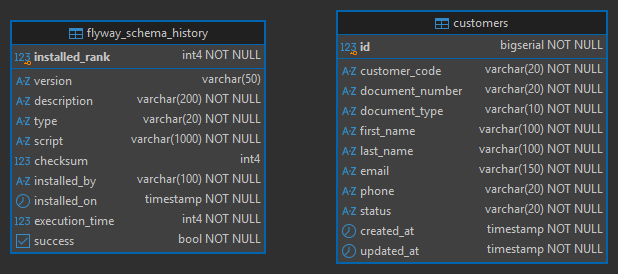

# 🏦 Sistema de Gestión de Cuentas Bancarias — Customers — Pure Hexagonal

## 📖 Contexto previo

Este proyecto es la contraparte "purista" del proyecto `banking-account-service`. En aquel proyecto, la capa de
**Aplicación** quedó "contaminada" con anotaciones específicas del framework, como `@Service` y `@Transactional`,
directamente en la clase de servicio que implementa los casos de uso.

Desde el punto de vista pragmático, lo que hicimos en `banking-account-service` es perfectamente válido: es un
**trade-off** (del inglés, "compensación" o "solución de compromiso") ampliamente aceptado en la industria. Consiste
en ceder un poco de pureza arquitectónica a cambio de simplicidad y menor cantidad de código repetitivo (*boilerplate*).
Lo que realmente importa, y en lo que sí debemos ser inflexibles, es en mantener el **dominio**
—que contiene la lógica de negocio y los modelos— completamente libre de dependencias externas.

En este nuevo proyecto, `banking-account-pure-hexagonal`, vamos a dar un paso más allá e implementar una **arquitectura
hexagonal 100 % pura**. Esto significa que ni `@Service`, ni `@Transactional`, ni ninguna otra
anotación o dependencia propia de un framework tendrá cabida en la capa de aplicación. En otras palabras,
respetaremos al pie de la letra la **regla de dependencia** de la arquitectura hexagonal.

Por otro lado, para mantener el enfoque didáctico, este proyecto solo cubrirá el dominio **Customer**. Los mismos
principios y patrones aplicados aquí son perfectamente extrapolables a los dominios `Account` y `Transaction`
trabajados previamente en `banking-account-service`.

> ⚠️ **Alcance de este documento**: en este archivo solo se documenta la **configuración inicial del proyecto**
> (dependencias, `application.yml`, migraciones con Flyway, levantamiento de la base de datos). La implementación
> del código —dominio, aplicación e infraestructura— se documenta en
> [`01.domain-application-infrastructure.md`](./01.domain-application-infrastructure.md).

### 📚 Índice de documentación

| Archivo                                   | Contenido                                                               |
|-------------------------------------------|-------------------------------------------------------------------------|
| `README.md` (este archivo)                | Contexto del proyecto, dependencias, configuración, Flyway, Docker      |
| `01.domain-application-infrastructure.md` | Implementación de las tres capas: dominio, aplicación e infraestructura |
| `02.pruebas-manuales.md`                  | Pruebas manuales de los endpoints del CRUD                              |
| `03.pruebas-transaccionalidad.md`         | Pruebas manuales verificando la ejecución transaccional                 |

> 💡 El proyecto también cuenta con pruebas automatizadas (unitarias y de integración) incluidas directamente en el
> código fuente (`src/test/java`), que no se documentan en un archivo aparte.

### 🎯 Objetivos de este proyecto

- ✅ Aplicar la regla de dependencia de forma estricta: `infrastructure → application → domain`.
- ✅ Mantener el dominio y la aplicación libres de anotaciones de Spring u otros frameworks.
- ✅ Resolver de forma elegante, ya en la capa de infraestructura, la creación de beans y el manejo transaccional.
- ✅ Construir un CRUD completo del dominio `Customer` como caso de estudio.

---

## 📦 Dependencias y plugins (`pom.xml`)

```xml
<?xml version="1.0" encoding="UTF-8"?>
<project xmlns="http://maven.apache.org/POM/4.0.0" xmlns:xsi="http://www.w3.org/2001/XMLSchema-instance"
         xsi:schemaLocation="http://maven.apache.org/POM/4.0.0 https://maven.apache.org/xsd/maven-4.0.0.xsd">
    <modelVersion>4.0.0</modelVersion>
    <parent>
        <groupId>org.springframework.boot</groupId>
        <artifactId>spring-boot-starter-parent</artifactId>
        <version>4.1.1</version>
        <relativePath/> <!-- lookup parent from repository -->
    </parent>
    <groupId>dev.magadiflo</groupId>
    <artifactId>banking-account-pure-hexagonal</artifactId>
    <version>0.0.1-SNAPSHOT</version>
    <properties>
        <java.version>25</java.version>
        <org.mapstruct.version>1.6.3</org.mapstruct.version>
        <lombok-mapstruct-binding.version>0.2.0</lombok-mapstruct-binding.version>
    </properties>
    <dependencies>
        <dependency>
            <groupId>org.springframework.boot</groupId>
            <artifactId>spring-boot-starter-data-jpa</artifactId>
        </dependency>
        <dependency>
            <groupId>org.springframework.boot</groupId>
            <artifactId>spring-boot-starter-flyway</artifactId>
        </dependency>
        <dependency>
            <groupId>org.springframework.boot</groupId>
            <artifactId>spring-boot-starter-validation</artifactId>
        </dependency>
        <dependency>
            <groupId>org.springframework.boot</groupId>
            <artifactId>spring-boot-starter-webmvc</artifactId>
        </dependency>
        <dependency>
            <groupId>org.flywaydb</groupId>
            <artifactId>flyway-database-postgresql</artifactId>
        </dependency>

        <!--Agregado manualmente-->
        <dependency>
            <groupId>org.mapstruct</groupId>
            <artifactId>mapstruct</artifactId>
            <version>${org.mapstruct.version}</version>
        </dependency>
        <!--/Agregado manualmente-->
        <dependency>
            <groupId>org.postgresql</groupId>
            <artifactId>postgresql</artifactId>
            <scope>runtime</scope>
        </dependency>
        <dependency>
            <groupId>org.projectlombok</groupId>
            <artifactId>lombok</artifactId>
            <optional>true</optional>
        </dependency>
        <dependency>
            <groupId>org.springframework.boot</groupId>
            <artifactId>spring-boot-starter-data-jpa-test</artifactId>
            <scope>test</scope>
        </dependency>
        <dependency>
            <groupId>org.springframework.boot</groupId>
            <artifactId>spring-boot-starter-flyway-test</artifactId>
            <scope>test</scope>
        </dependency>
        <dependency>
            <groupId>org.springframework.boot</groupId>
            <artifactId>spring-boot-starter-validation-test</artifactId>
            <scope>test</scope>
        </dependency>
        <dependency>
            <groupId>org.springframework.boot</groupId>
            <artifactId>spring-boot-starter-webmvc-test</artifactId>
            <scope>test</scope>
        </dependency>
    </dependencies>

    <build>
        <plugins>
            <plugin>
                <groupId>org.springframework.boot</groupId>
                <artifactId>spring-boot-maven-plugin</artifactId>
                <configuration>
                    <excludes>
                        <exclude>
                            <groupId>org.projectlombok</groupId>
                            <artifactId>lombok</artifactId>
                        </exclude>
                    </excludes>
                </configuration>
            </plugin>
            <plugin>
                <groupId>org.apache.maven.plugins</groupId>
                <artifactId>maven-compiler-plugin</artifactId>
                <version>${maven-compiler-plugin.version}</version>
                <configuration>
                    <source>${java.version}</source>
                    <target>${java.version}</target>
                    <annotationProcessorPaths>
                        <path>
                            <groupId>org.projectlombok</groupId>
                            <artifactId>lombok</artifactId>
                            <version>${lombok.version}</version>
                        </path>
                        <path>
                            <groupId>org.mapstruct</groupId>
                            <artifactId>mapstruct-processor</artifactId>
                            <version>${org.mapstruct.version}</version>
                        </path>
                        <path>
                            <groupId>org.projectlombok</groupId>
                            <artifactId>lombok-mapstruct-binding</artifactId>
                            <version>${lombok-mapstruct-binding.version}</version>
                        </path>
                    </annotationProcessorPaths>
                </configuration>
                <executions>
                    <execution>
                        <id>default-compile</id>
                        <phase>compile</phase>
                        <goals>
                            <goal>compile</goal>
                        </goals>
                        <configuration>
                            <annotationProcessorPaths>
                                <path>
                                    <groupId>org.projectlombok</groupId>
                                    <artifactId>lombok</artifactId>
                                </path>
                            </annotationProcessorPaths>
                        </configuration>
                    </execution>
                    <execution>
                        <id>default-testCompile</id>
                        <phase>test-compile</phase>
                        <goals>
                            <goal>testCompile</goal>
                        </goals>
                        <configuration>
                            <annotationProcessorPaths>
                                <path>
                                    <groupId>org.projectlombok</groupId>
                                    <artifactId>lombok</artifactId>
                                </path>
                            </annotationProcessorPaths>
                        </configuration>
                    </execution>
                </executions>
            </plugin>
        </plugins>
    </build>

</project>
```

### 🔍 Notas sobre la configuración

Spring Boot 4 introdujo una **modularización profunda** de los starters, que reemplaza el histórico
`spring-boot-autoconfigure` monolítico por módulos pequeños y específicos por tecnología. Esto trae dos cambios que se
reflejan directamente en este `pom.xml`:

| Cambio            | Antes (Spring Boot 3)                        | Ahora (Spring Boot 4)                                                               |
|-------------------|----------------------------------------------|-------------------------------------------------------------------------------------|
| Starter web       | `spring-boot-starter-web`                    | `spring-boot-starter-webmvc`                                                        |
| Soporte de Flyway | Solo se agregaba `flyway-core` directamente  | Requiere el starter `spring-boot-starter-flyway`                                    |
| Starters de test  | Un único `spring-boot-starter-test` genérico | Un starter de test dedicado por tecnología: `spring-boot-starter-<tecnología>-test` |

> ⚠️ Los nombres antiguos (`spring-boot-starter-web`, por ejemplo) siguen funcionando por compatibilidad, pero están
> marcados como deprecados y se recomienda migrar a los nuevos nombres modulares.

### 🧩 Sobre MapStruct y Lombok

El orden de los `annotationProcessorPaths` es importante: `lombok-mapstruct-binding` debe declararse **después** de
Lombok y de MapStruct, ya que actúa como puente entre ambos procesadores de anotaciones, evitando conflictos cuando
una clase usa `@Data`/`@Getter` de Lombok junto con `@Mapper` de MapStruct.

## ⚙️ Configuraciones en el `application.yml`

````yml
server:
  port: 8080
  error:
    include-message: always

spring:
  application:
    name: banking-account-pure-hexagonal
  # 🆕 Versionado de API (nativo desde Spring Boot 4 / Spring Framework 7)
  mvc:
    api-version:
      required: true          # Toda petición debe indicar una versión explícita
      supported: 1,2           # Versiones soportadas por la API
      use:
        path-segment: 1        # La versión se extrae del segundo segmento de la URL (ej: /api/1/customers)

  datasource:
    url: jdbc:postgresql://localhost:5435/db_hexagonal
    username: magadiflo
    password: magadiflo

  jpa:
    hibernate:
      ddl-auto: validate       # Hibernate solo valida el esquema; Flyway es quien lo crea/migra
    properties:
      hibernate:
        format_sql: true

  flyway:
    baseline-on-migrate: true
    validate-on-migrate: true
    enabled: true
    locations: classpath:db/migration
    baseline-description: 'init'
    baseline-version: 0

logging:
  level:
    dev.magadiflo.banking.app: debug
    org.hibernate.SQL: debug
    org.flywaydb: info
````

#### 📌 Detalle de las secciones

| Sección                                       | Propósito                                                                                                                                                                                                                                                                                                               |
|-----------------------------------------------|-------------------------------------------------------------------------------------------------------------------------------------------------------------------------------------------------------------------------------------------------------------------------------------------------------------------------|
| **`server`**                                  | Define el puerto de la aplicación (`8080`) e indica que los mensajes de error detallados siempre se incluyan en la respuesta (`include-message: always`), útil en desarrollo para depurar más rápido.                                                                                                                   |
| **`spring.mvc.api-version`**                  | Habilita el versionado nativo de API de Spring Boot 4. Se exige que cada request especifique una versión (`required: true`), se declaran las versiones soportadas (`1` y `2`), y se define que la versión se resuelva a partir del segundo segmento de la URL, por ejemplo `/api/1/customers`.                          |
| **`spring.datasource`**                       | Conexión a la base de datos PostgreSQL que corre en el puerto `5435` (mapeado desde un contenedor Docker, ya que el puerto por defecto de PostgreSQL es `5432`).                                                                                                                                                        |
| **`spring.jpa.hibernate.ddl-auto: validate`** | Le indica a Hibernate que **no** debe crear ni modificar el esquema de la base de datos; solo debe validar que las entidades coincidan con las tablas existentes. La responsabilidad de crear/migrar el esquema recae completamente en Flyway.                                                                          |
| **`spring.flyway`**                           | Configura Flyway como la herramienta de migraciones. `baseline-on-migrate: true` permite que Flyway trabaje sobre una base de datos que ya existe (creando una línea base), y `validate-on-migrate: true` asegura que los scripts aplicados coincidan con los que existen en el classpath, evitando desincronizaciones. |
| **`logging.level`**                           | Ajusta el nivel de logs a `debug` para el paquete propio de la aplicación y para las sentencias SQL generadas por Hibernate (`org.hibernate.SQL`), lo cual es muy útil durante el desarrollo para verificar las queries generadas. Flyway se deja en `info` para no saturar el log con detalles innecesarios.           |

> 💡 **Buena práctica:** la combinación `ddl-auto: validate` + `Flyway` es el enfoque recomendado en proyectos reales,
> ya que separa claramente dos responsabilidades: `Hibernate` se encarga del mapeo `objeto-relacional`, mientras que
> `Flyway` controla de forma versionada y auditable la evolución del esquema de base de datos.

## 🛠️ Creando archivos SQL para usar con Flyway

Flyway gestiona la evolución del esquema de base de datos mediante scripts de migración versionados. Cada script
representa un cambio incremental y controlado sobre el esquema, lo que permite mantener un historial auditable y
reproducible en cualquier entorno (desarrollo, pruebas, producción).

### 📄 Script: `V1__create_customers_table.sql`

📍 Ruta del archivo: `src/main/resources/db/migration/V1__create_customers_table.sql`

````postgresql
-- V1: Creación de la tabla customers
CREATE TABLE customers
(
    id              BIGSERIAL    NOT NULL, --Clave interna(PK): usado para joins, FK en otras tablas, índices, etc.
    customer_code   VARCHAR(20)  NOT NULL, --Referencia de negocio, la que viaja en la API, URLs, respuestas JSON
    document_number VARCHAR(20)  NOT NULL,
    document_type   VARCHAR(10)  NOT NULL,
    first_name      VARCHAR(100) NOT NULL,
    last_name       VARCHAR(100) NOT NULL,
    email           VARCHAR(150) NOT NULL,
    phone           VARCHAR(20)  NOT NULL,
    status          VARCHAR(20)  NOT NULL DEFAULT 'ACTIVE',
    created_at      TIMESTAMP    NOT NULL DEFAULT now(),
    updated_at      TIMESTAMP    NOT NULL DEFAULT now(),

    CONSTRAINT pk_customers PRIMARY KEY (id),
    CONSTRAINT uq_customers_customer_code UNIQUE (customer_code),
    CONSTRAINT uq_customers_document_number UNIQUE (document_number),
    CONSTRAINT uq_customers_email UNIQUE (email),
    CONSTRAINT chk_customers_document_type CHECK (document_type IN ('DNI', 'RUC', 'PASSPORT')),
    CONSTRAINT chk_customers_status CHECK (status IN ('ACTIVE', 'INACTIVE', 'BLOCKED'))
);

-- Índices para búsquedas frecuentes
-- Nota: customer_code, document_number y email ya tienen índices automáticos por sus restricciones UNIQUE
CREATE INDEX idx_customers_status ON customers (status);

COMMENT
    ON TABLE customers IS 'Tabla de clientes del banco';
COMMENT
    ON COLUMN customers.id IS 'Primary Key: usado para joins, FK, índices, etc.';
COMMENT
    ON COLUMN customers.customer_code IS 'Referencia de negocio, la que viaja en la API, URLs, respuestas JSON';
COMMENT
    ON COLUMN customers.document_number IS 'Número de documento de identidad';
COMMENT
    ON COLUMN customers.document_type IS 'Tipo de documento: DNI, RUC, PASSPORT';
COMMENT
    ON COLUMN customers.status IS 'Estado del cliente: ACTIVE, INACTIVE, BLOCKED';
````

#### 📌 Detalle del diseño de la tabla

| Elemento                                       | Descripción                                                                                                                                                                                                                                                                                       |
|------------------------------------------------|---------------------------------------------------------------------------------------------------------------------------------------------------------------------------------------------------------------------------------------------------------------------------------------------------|
| **`id` (PK interna)**                          | Clave técnica autoincremental (`BIGSERIAL`), pensada exclusivamente para uso interno: relaciones (FK), joins e índices. **Nunca** debería exponerse directamente en la API.                                                                                                                       |
| **`customer_code` (identificador de negocio)** | Este es el identificador que sí viaja hacia el exterior: URLs, respuestas JSON, integraciones con otros sistemas. Separar la clave técnica de la clave de negocio es una práctica recomendada, ya que permite cambiar la estrategia de generación de IDs internos sin afectar contratos externos. |
| **Restricciones `UNIQUE`**                     | Garantizan a nivel de base de datos que no existan clientes duplicados por código, documento o email — una validación que complementa (no reemplaza) las reglas de negocio en el dominio.                                                                                                         |
| **Restricciones `CHECK`**                      | Limitan los valores posibles de `document_type` y `status` directamente en la base de datos, actuando como una segunda capa de defensa frente a datos inconsistentes, incluso si la validación de la aplicación fallara.                                                                          |
| **Índice sobre `status`**                      | Se crea explícitamente porque `status` no tiene una restricción `UNIQUE` que genere un índice automático, pero sí es un campo frecuentemente usado en filtros (por ejemplo, "listar todos los clientes activos").                                                                                 |
| **`COMMENT ON`**                               | Documenta directamente en el esquema el propósito de la tabla y de cada columna clave. Muy útil para cualquier persona que explore la base de datos con una herramienta cliente SQL, sin depender de documentación externa.                                                                       |

> 💡 **Sobre la separación entre PK técnica y código de negocio:** este es un patrón muy usado en sistemas donde los
> identificadores internos podrían necesitar cambiar de estrategia en el futuro (por ejemplo, migrar de `BIGSERIAL`
> a `UUID`), sin que eso rompa ningún contrato ya expuesto hacia clientes externos.

## 🐳 Levantando el contenedor de base de datos PostgreSQL

Antes de ejecutar la aplicación, necesitamos levantar el contenedor de PostgreSQL que Flyway usará para aplicar las
migraciones y que la aplicación usará como fuente de datos.

### 1️⃣ Levantar el contenedor con Docker Compose

````bash
D:\programming\spring\15.martin_diaz\hexagonal-architecture (main -> origin)
$ docker compose -f .\docker\compose.yml up -d                              
[+] up 3/3                                                                  
 ✔ Network hexagonal-net          Created                                   
 ✔ Volume postgres-hexagonal-data Created                                   
 ✔ Container c-postgres-hexagonal Started                                   
````

El comando `docker compose -f .\docker\compose.yml up -d` crea y levanta en segundo plano (`-d`, detached) todos los
recursos definidos en el archivo `compose.yml`:

- 🌐 **hexagonal-net:** una red Docker dedicada, que permite que los contenedores del proyecto se comuniquen entre sí de
  forma aislada.
- 💾 **postgres-hexagonal-data:** un volumen persistente, que asegura que los datos de la base sobrevivan aunque el
  contenedor se detenga o se elimine.
- 📦 **c-postgres-hexagonal:** el contenedor propiamente dicho, corriendo la imagen de PostgreSQL.

### 2️⃣ Verificar que el contenedor está corriendo

````bash
$ docker container ls -a
CONTAINER ID   IMAGE                COMMAND                  CREATED         STATUS          PORTS                                         NAMES
4b9bf48ac08a   postgres:17-alpine   "docker-entrypoint.s…"   4 seconds ago   Up 4 seconds    0.0.0.0:5435->5432/tcp, [::]:5435->5432/tcp   c-postgres-hexagonal 
````

#### 📌 Detalle relevante: mapeo de puertos

| Puerto host | Puerto contenedor | Explicación                                                                                                                                                                                                         |
|-------------|-------------------|---------------------------------------------------------------------------------------------------------------------------------------------------------------------------------------------------------------------|
| `5435`      | `5432`            | El puerto **`5432`** es el puerto por defecto en el que PostgreSQL escucha **dentro** del contenedor. El puerto **`5435`** es el puerto expuesto hacia la máquina host (tu PC), redirigido hacia el `5432` interno. |

> 💡 **¿Por qué remapear el puerto?** Es una práctica común cuando ya tienes una instancia de PostgreSQL corriendo
> localmente (o en otro contenedor) usando el puerto `5432` por defecto. Remapear a `5435` evita conflictos de puertos
> y te permite tener múltiples instancias de PostgreSQL corriendo en paralelo sin que se interfieran entre sí.

Esto explica, por cierto, por qué en el `application.yml` que configuramos anteriormente la URL de conexión apunta al
puerto `5435`.

## 🚀 Ejecuta la aplicación e inicia la migración con Flyway

Con el contenedor de PostgreSQL corriendo, ya podemos levantar la aplicación. Al iniciarla, Flyway se ejecuta
automáticamente (gracias a `spring.flyway.enabled: true`) antes de que Hibernate valide el esquema, aplicando cualquier
migración pendiente.

### 1️⃣ Logs de arranque: ejecución de Flyway

````bash
...
2026-09-09T00:32:03.704-05:00  INFO 11792 --- [banking-account-pure-hexagonal] [           main] org.flywaydb.core.FlywayExecutor         : Database: jdbc:postgresql://localhost:5435/db_hexagonal (PostgreSQL 17.5)
2026-09-09T00:32:03.805-05:00  INFO 11792 --- [banking-account-pure-hexagonal] [           main] o.f.c.i.s.JdbcTableSchemaHistory         : Schema history table "public"."flyway_schema_history" does not exist yet
2026-09-09T00:32:03.818-05:00  INFO 11792 --- [banking-account-pure-hexagonal] [           main] o.f.core.internal.command.DbValidate     : Successfully validated 1 migration (execution time 00:00.036s)
2026-09-09T00:32:03.918-05:00  INFO 11792 --- [banking-account-pure-hexagonal] [           main] org.flywaydb.core.Flyway                 : All configured schemas are empty; a baseline marker will not be added to Flyway's schema history table. A baseline or migration script with a lower version than the baseline version may execute if available. Check the Schemas parameter if this is not intended. See https://help.red-gate.com/help/flyway-cli12/help_4.aspx?topic=baseline-on-migrate for more info
2026-09-09T00:32:03.927-05:00  INFO 11792 --- [banking-account-pure-hexagonal] [           main] o.f.c.i.s.JdbcTableSchemaHistory         : Creating Schema History table "public"."flyway_schema_history" ...
2026-09-09T00:32:04.037-05:00  INFO 11792 --- [banking-account-pure-hexagonal] [           main] o.f.core.internal.command.DbMigrate      : Current version of schema "public": << Empty Schema >>
2026-09-09T00:32:04.058-05:00  INFO 11792 --- [banking-account-pure-hexagonal] [           main] o.f.core.internal.command.DbMigrate      : Migrating schema "public" to version "1 - create customers table"
2026-09-09T00:32:04.139-05:00  INFO 11792 --- [banking-account-pure-hexagonal] [           main] o.f.core.internal.command.DbMigrate      : Successfully applied 1 migration to schema "public", now at version v1 (execution time 00:00.042s)
...
````

#### 📌 ¿Qué está pasando aquí?

| Paso                                    | Descripción                                                                                                                                                                                                                                              |
|-----------------------------------------|----------------------------------------------------------------------------------------------------------------------------------------------------------------------------------------------------------------------------------------------------------|
| **Conexión a la base**                  | Flyway se conecta a la base `db_hexagonal` en el puerto `5435` y detecta la versión de PostgreSQL (`17.5`).                                                                                                                                              |
| **Creación de `flyway_schema_history`** | Como es la primera ejecución, la tabla de control de migraciones aún no existe, así que Flyway la crea automáticamente. Esta tabla es el "libro de registro" donde Flyway lleva el historial de qué scripts se han aplicado, cuándo y con qué resultado. |
| **Validación previa**                   | Antes de migrar, Flyway valida que los scripts presentes en `classpath:db/migration` sean consistentes (gracias a `validate-on-migrate: true`), evitando aplicar cambios corruptos o modificados después de haber sido ejecutados.                       |
| **Baseline omitido**                    | Como el esquema estaba completamente vacío, Flyway informa que no era necesario crear un marcador de línea base (`baseline`), ya que `baseline-on-migrate` solo entra en acción cuando existe un esquema previo sin historial de Flyway.                 |
| **Migración aplicada**                  | Finalmente, Flyway ejecuta `V1__create_customers_table.sql`, llevando el esquema de `<< Empty Schema >>` a la versión `v1`.                                                                                                                              |

> 💡 **Dato clave:** si detuvieras la aplicación y la volvieras a levantar en este punto, Flyway no volvería a ejecutar
> `V1__create_customers_table.sql`, ya que reconoce (mediante el checksum registrado en `flyway_schema_history`)
> que esa migración ya fue aplicada exitosamente.

### 2️⃣ Tablas generadas



### 3️⃣ Verificación manual dentro del contenedor

Podemos confirmar el resultado ingresando directamente al contenedor y consultando la base con psql, el cliente de línea
de comandos de PostgreSQL:

````bash
$ docker container exec -it c-postgres-hexagonal /bin/sh
/ # psql -U magadiflo -d db_hexagonal
psql (17.5)
Type "help" for help.

db_hexagonal=# \dt
                 List of relations
 Schema |         Name          | Type  |   Owner
--------+-----------------------+-------+-----------
 public | customers             | table | magadiflo
 public | flyway_schema_history | table | magadiflo
(2 rows)

db_hexagonal=# SELECT * FROM flyway_schema_history;
 installed_rank | version |      description       | type |             script             | checksum  | installed_by |        installed_on        | execution_time | success
----------------+---------+------------------------+------+--------------------------------+-----------+--------------+----------------------------+----------------+---------
              1 | 1       | create customers table | SQL  | V1__create_customers_table.sql | 630149399 | magadiflo    | 2026-09-09 00:32:04.022355 |             42 | t
(1 row) 
````

`docker container exec -it c-postgres-hexagonal /bin/sh` abre una sesión interactiva dentro del contenedor, desde donde
ejecutamos `psql` para conectarnos a la base de datos. El comando `\dt` (describe tables) lista las tablas del esquema
`public`, confirmando que existen `customers` (nuestra tabla de negocio) y `flyway_schema_history` (la tabla de control
de Flyway).

Al consultar `flyway_schema_history`, vemos el registro completo de la migración aplicada: su versión (`1`),
descripción, script origen, checksum de integridad, usuario que la ejecutó, fecha/hora, tiempo de ejecución y el flag
`success = t` (verdadero), que confirma que se aplicó sin errores.

