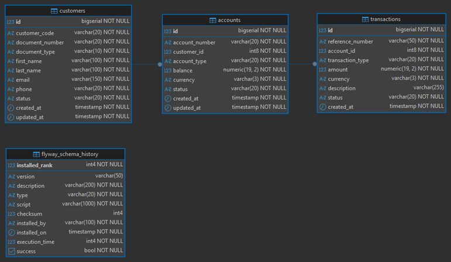

# 🏦 Sistema de Gestión de Cuentas Bancarias — `banking-account-service`

---

# 1️⃣ Configuración inicial del proyecto (application.yml + Flyway)

---

## 🐳 Configuración de la Base de Datos PostgreSQL en Docker

Para facilitar el desarrollo y mantener un entorno aislado, configuramos un contenedor de `PostgreSQL` usando
`Docker Compose`. Esto nos permite levantar la base de datos de manera reproducible en cualquier máquina, sin necesidad
de instalar `PostgreSQL` directamente en el sistema operativo.

Este archivo se crea en la raíz de este repositorio: `docker/compose.yml`.

````yml
services:
  s-postgres-hexagonal:
    image: postgres:17-alpine
    container_name: c-postgres-hexagonal
    restart: unless-stopped
    ports:
      - '5435:5432'
    environment:
      POSTGRES_DB: db_hexagonal
      POSTGRES_USER: magadiflo
      POSTGRES_PASSWORD: magadiflo
    volumes:
      - postgres-hexagonal-data:/var/lib/postgresql/data
    networks:
      - hexagonal-net

volumes:
  postgres-hexagonal-data:
    name: postgres-hexagonal-data

networks:
  hexagonal-net:
    name: hexagonal-net
````

## Dependencias

En esta primera etapa iniciamos creando el proyecto `banking-account-service` a través de
[Spring Initializr (ver dependencias)](https://start.spring.io/#!type=maven-project&language=java&platformVersion=4.0.3&packaging=jar&configurationFileFormat=yaml&jvmVersion=25&groupId=dev.magadiflo.banking.app&artifactId=banking-account-service&name=banking-account-service&description=Demo%20project%20for%20Spring%20Boot&packageName=dev.magadiflo.banking.app&dependencies=web,data-jpa,validation,postgresql,flyway,lombok)
donde seleccionamos las dependencias necesarias para constuir un servicio bancario robusto.

La única dependencia agregada manualmente fue `MapStruct`, junto con su `plugin` para facilitar la generación de mapeos
entre objetos.

````xml
<!--Spring Boot 4.0.3-->
<!--Java 25-->
<!--org.mapstruct.version 1.6.3-->
<!--lombok-mapstruct-binding.version 0.2.0-->
<dependencies>
    <!-- ===== SPRING BOOT ===== -->
    <dependency>
        <groupId>org.springframework.boot</groupId>
        <artifactId>spring-boot-starter-data-jpa</artifactId>
    </dependency>
    <dependency>
        <groupId>org.springframework.boot</groupId>
        <artifactId>spring-boot-starter-webmvc</artifactId>
    </dependency>
    <dependency>
        <groupId>org.springframework.boot</groupId>
        <artifactId>spring-boot-starter-validation</artifactId>
    </dependency>

    <!-- ===== BASE DE DATOS ===== -->
    <dependency>
        <groupId>org.postgresql</groupId>
        <artifactId>postgresql</artifactId>
        <scope>runtime</scope>
    </dependency>
    <dependency>
        <groupId>org.springframework.boot</groupId>
        <artifactId>spring-boot-starter-flyway</artifactId>
    </dependency>
    <dependency>
        <groupId>org.flywaydb</groupId>
        <artifactId>flyway-database-postgresql</artifactId>
    </dependency>

    <!-- ===== MAPSTRUCT ===== -->
    <dependency>
        <groupId>org.mapstruct</groupId>
        <artifactId>mapstruct</artifactId>
        <version>${org.mapstruct.version}</version>
    </dependency>

    <!-- ===== LOMBOK ===== -->
    <dependency>
        <groupId>org.projectlombok</groupId>
        <artifactId>lombok</artifactId>
        <optional>true</optional>
    </dependency>

    <!-- ===== TESTING ===== -->
    <dependency>
        <groupId>org.springframework.boot</groupId>
        <artifactId>spring-boot-starter-data-jpa-test</artifactId>
        <scope>test</scope>
    </dependency>
    <dependency>
        <groupId>org.springframework.boot</groupId>
        <artifactId>spring-boot-starter-flyway-test</artifactId>
        <scope>test</scope>
    </dependency>
    <dependency>
        <groupId>org.springframework.boot</groupId>
        <artifactId>spring-boot-starter-validation-test</artifactId>
        <scope>test</scope>
    </dependency>
    <dependency>
        <groupId>org.springframework.boot</groupId>
        <artifactId>spring-boot-starter-webmvc-test</artifactId>
        <scope>test</scope>
    </dependency>
</dependencies>
````

### 🔎 Explicación de las dependencias

- `spring-boot-starter-data-jpa` → Proporciona integración con JPA/Hibernate, ideal para manejar entidades y
  repositorios.
- `spring-boot-starter-webmvc` → Permite construir APIs REST usando el modelo MVC.
- `spring-boot-starter-validation` → Añade soporte para validaciones con anotaciones como `@NotNull`, `@Size`, etc.
- `postgresql` → Driver JDBC para conectarse a la base de datos PostgreSQL.
- `flyway` → Herramienta de migración de base de datos, asegura que el esquema evolucione de forma controlada.
- `mapstruct` → Generador de mapeos entre DTOs y entidades, evitando código repetitivo.
- `lombok` → Reduce el boilerplate con anotaciones como `@Getter`, `@Builder`, etc.
- `testing starters` → Facilitan pruebas unitarias e integración para cada módulo (JPA, Flyway, Web, Validation).

### ⚙️ Configuración de Plugins

Los plugins en el `pom.xml` permiten que el proyecto compile correctamente y procese anotaciones.

- `maven-compiler-plugin` → Define la versión de Java y gestiona los annotation processors.
    - Aquí se incluyen `Lombok` y `MapStruct`, que generan código automáticamente durante la compilación.
- `spring-boot-maven-plugin` → Empaqueta la aplicación como un `fat JAR` ejecutable y permite correrla con
  `mvn spring-boot:run`.
    - La exclusión de Lombok evita conflictos en tiempo de ejecución, ya que Lombok solo es necesario en compilación.

````xml

<build>
    <plugins>
        <!--MapStruct-->
        <plugin>
            <groupId>org.apache.maven.plugins</groupId>
            <artifactId>maven-compiler-plugin</artifactId>
            <version>${maven-compiler-plugin.version}</version>
            <configuration>
                <source>${java.version}</source>
                <target>${java.version}</target>
                <annotationProcessorPaths>
                    <path>
                        <groupId>org.projectlombok</groupId>
                        <artifactId>lombok</artifactId>
                        <version>${lombok.version}</version>
                    </path>
                    <path>
                        <groupId>org.mapstruct</groupId>
                        <artifactId>mapstruct-processor</artifactId>
                        <version>${org.mapstruct.version}</version>
                    </path>
                    <path>
                        <groupId>org.projectlombok</groupId>
                        <artifactId>lombok-mapstruct-binding</artifactId>
                        <version>${lombok-mapstruct-binding.version}</version>
                    </path>
                </annotationProcessorPaths>
            </configuration>
        </plugin>
        <!--/MapStruct-->
        <plugin>
            <groupId>org.springframework.boot</groupId>
            <artifactId>spring-boot-maven-plugin</artifactId>
            <configuration>
                <excludes>
                    <exclude>
                        <groupId>org.projectlombok</groupId>
                        <artifactId>lombok</artifactId>
                    </exclude>
                </excludes>
            </configuration>
        </plugin>
    </plugins>
</build>
````

## ⚙️ Configuraciones en el application.yml

En esta sección definimos las propiedades de configuración del servicio `banking-account-service`, centralizando
parámetros de servidor, base de datos, migraciones y servicios externos.

````yml
server:
  port: 8080
  error:
    include-message: always

spring:
  application:
    name: banking-account-service

  # API Versioning (Spring Boot 4)
  mvc:
    api-version:
      required: true
      supported: 1,2
      use:
        path-segment: 1

  datasource:
    url: jdbc:postgresql://localhost:5435/db_hexagonal
    username: magadiflo
    password: magadiflo

  jpa:
    hibernate:
      ddl-auto: validate    # validate: hibernate solo valida el schema, Flyway es quien lo crea
    properties:
      hibernate:
        format_sql: true

  flyway:
    baseline-on-migrate: true
    validate-on-migrate: true
    enabled: true
    locations: classpath:db/migration
    baseline-description: 'init'
    baseline-version: 0

# ===== Configuración personalizada del servicio externo (ExchangeRate API) =====
exchange-rate:
  api:
    base-url: https://v6.exchangerate-api.com/v6
    api-key: YOUR_API_KEY_HERE     # Reemplazar con el API key real
    timeout-seconds: 5

logging:
  level:
    dev.magadiflo: debug
    org.hibernate.SQL: debug
    org.flywaydb: info
````

- `spring.mvc.api-version`: En `Spring Boot 4`, se ha introducido el soporte nativo para el versionamiento de APIs
  directamente en el núcleo de `spring-mvc`.
    - `required: true`: Obliga a que todas las peticiones incluyan una versión. Si el cliente no la envía, la solicitud
      fallará (generalmente con un 400 Bad Request).
    - `supported: 1,2`: Define qué versiones son válidas en tu aplicación. En este caso, solo aceptará peticiones
      marcadas como versión 1 o 2.
    - `use.path-segment: 1`: Indica que la versión se debe extraer de un segmento de la ruta (URL). El valor `1` es el
      índice del segmento de ruta donde se espera la versión. Por ejemplo:
        - Para una estructura de URL como `/{versión}/resource`, use `0`.
        - Para una estructura de URL como `/api/{versión}/resource`, use `1` (nuestro caso).
- `hibernate.ddl-auto: validate` → Hibernate solo valida que el esquema de la BD coincida con las entidades.
    - No crea ni modifica tablas.
    - La responsabilidad de migraciones recae en `Flyway` (buena práctica en entornos productivos).

- `spring.flyway`
    - `baseline-on-migrate: true` → Permite inicializar la base de datos con una versión base cuando ya existen tablas.
    - `validate-on-migrate: true` → Verifica que las migraciones aplicadas coincidan con el historial esperado.
    - `enabled: true` → Activa `Flyway` en la aplicación.
    - `locations: classpath:db/migration` → Carpeta donde se ubican los scripts SQL de migración.
    - `baseline-description: 'init'` → Descripción de la versión inicial.
    - `baseline-version: 0` → Define la versión base de la migración.

## 🛠️ Creando archivos SQL para usar con Flyway

> **⚠️ Nota.** En el siguiente repositorio también se hace uso de Flyway:
> [microservices-e-commerce](https://github.com/magadiflo/microservices-e-commerce/tree/main/business-domain/product-service)

Cuando agregamos la dependencia de `Flyway` desde `Spring Initializr`, automáticamente se crea el directorio:
`src/main/resources/db/migration`. Dentro de este directorio colocaremos todos los scripts `.sql` que `Flyway`
ejecutará en orden secuencial.

👉 Importante:
> Aunque usamos `JPA/Hibernate`, la configuración `ddl-auto: validate` hace que `Hibernate` solo `valide el esquema`
> existente contra las entidades, pero `no lo cree ni lo actualice`. La responsabilidad de crear y evolucionar la base
> de datos recae en `Flyway`, lo cual es la práctica recomendada en entornos productivos.

### 📑 Convención de nombres en Flyway

`Flyway` utiliza una `convención estricta de nombres` para identificar y ejecutar las migraciones en orden.
Cada archivo debe seguir el formato:

````bash
V<versión>__<descripcion>.sql 
````

- `V` → Indica que es una migración de versión (Versioned Migration).
- `<versión>` → Número incremental que define el orden de ejecución (ejemplo: 1, 2, 3 …).
- `__` (doble guion bajo) → Separador obligatorio entre la versión y la descripción.
- `<descripcion>` → Texto descriptivo en minúsculas y con guiones bajos, que explica la acción del script
  (ejemplo: `create_customers_table`).
- `.sql` → Extensión del archivo, ya que `Flyway` ejecuta directamente scripts `SQL`.

````bash
V1__create_customers_table.sql
V2__create_accounts_table.sql
V3__create_transactions_table.sql
````

### 📄 Script: V1__create_customers_table.sql

Ruta del archivo:

````bash
src/main/resources/db/migration/V1__create_customers_table.sql
````

````sql
-- V1: Creación de la tabla customers
CREATE TABLE customers
(
    id              BIGSERIAL    NOT NULL, --Clave interna(PK): usado para joins, FK en otras tablas, índices, etc.
    customer_code   VARCHAR(20)  NOT NULL, --Referencia de negocio, la que viaja en la API, URLs, respuestas JSON
    document_number VARCHAR(20)  NOT NULL,
    document_type   VARCHAR(10)  NOT NULL,
    first_name      VARCHAR(100) NOT NULL,
    last_name       VARCHAR(100) NOT NULL,
    email           VARCHAR(150) NOT NULL,
    phone           VARCHAR(20)  NOT NULL,
    status          VARCHAR(20)  NOT NULL DEFAULT 'ACTIVE',
    created_at      TIMESTAMP    NOT NULL DEFAULT now(),
    updated_at      TIMESTAMP    NOT NULL DEFAULT now(),

    CONSTRAINT pk_customers PRIMARY KEY (id),
    CONSTRAINT uq_customers_customer_code UNIQUE (customer_code),
    CONSTRAINT uq_customers_document_number UNIQUE (document_number),
    CONSTRAINT uq_customers_email UNIQUE (email),
    CONSTRAINT chk_customers_document_type CHECK (document_type IN ('DNI', 'RUC', 'PASAPORTE')),
    CONSTRAINT chk_customers_status CHECK (status IN ('ACTIVE', 'INACTIVE', 'BLOCKED'))
);

-- Índices para búsquedas frecuentes
-- Nota: document_number y email ya tienen índices por sus restricciones UNIQUE
CREATE INDEX idx_customers_status ON customers (status);

COMMENT
ON TABLE customers IS 'Tabla de clientes del banco';
COMMENT
ON COLUMN customers.id IS 'Primary Key: usado para joins, FK, índices, etc.';
COMMENT
ON COLUMN customers.customer_code IS 'Referencia de negocio, la que viaja en la API, URLs, respuestas JSON';
COMMENT
ON COLUMN customers.document_number IS 'Número de documento de identidad';
COMMENT
ON COLUMN customers.document_type IS 'Tipo de documento: DNI, RUC, PASAPORTE';
COMMENT
ON COLUMN customers.status IS 'Estado del cliente: ACTIVE, INACTIVE, BLOCKED';
````

### 📄 Script: V2__create_accounts_table.sql

Ruta del archivo:

````bash
src/main/resources/db/migration/V2__create_accounts_table.sql
````

````sql
-- V2: Creación de la tabla accounts
CREATE TABLE accounts
(
    id             BIGSERIAL      NOT NULL,                        --Clave interna(PK): usado para joins, FK en otras tablas, índices, etc.
    account_number VARCHAR(20)    NOT NULL,                        --Referencia de negocio, la que viaja en la API, URLs, respuestas JSON
    customer_id    BIGINT         NOT NULL,                        --FK hacia customers.id
    account_type   VARCHAR(20)    NOT NULL,
    balance        DECIMAL(19, 2) NOT NULL DEFAULT 0.00,
    currency       VARCHAR(3)     NOT NULL DEFAULT 'PEN',
    status         VARCHAR(20)    NOT NULL DEFAULT 'ACTIVE',
    created_at     TIMESTAMP      NOT NULL DEFAULT now(),
    updated_at     TIMESTAMP      NOT NULL DEFAULT now(),

    CONSTRAINT pk_accounts PRIMARY KEY (id),                       -- PK crea índice único automáticamente
    CONSTRAINT uq_accounts_account_number UNIQUE (account_number), -- UNIQUE crea índice único automáticamente

    -- ON DELETE RESTRICT: Impide borrar un cliente si existen cuentas asociadas que lo referencian.
    -- Garantiza la integridad referencial.
    -- Nota: es muy parecido a NO ACTION (que es el valor por defecto), pero la diferencia es que RESTRICT
    -- valida inmediatamente la restricción en el momento de ejecutar la sentencia, mientras que NO ACTION
    -- espera hasta el final de la transacción para comprobarla.
    CONSTRAINT fk_accounts_customer FOREIGN KEY (customer_id)
        REFERENCES customers (id) ON DELETE RESTRICT,

    CONSTRAINT chk_accounts_balance CHECK (balance >= 0),
    CONSTRAINT chk_accounts_account_type CHECK (account_type IN ('SAVINGS', 'CHECKING')),
    CONSTRAINT chk_accounts_currency CHECK (currency IN ('PEN', 'USD', 'EUR')),
    CONSTRAINT chk_accounts_status CHECK (status IN ('ACTIVE', 'INACTIVE', 'BLOCKED', 'CLOSED'))
);

-- Índices para búsquedas frecuentes
CREATE INDEX idx_accounts_customer_id ON accounts (customer_id); -- Creamos índice de customer_id, porque el FK no crea índice automático
CREATE INDEX idx_accounts_status ON accounts (status); -- útil para filtrar cuentas por estado

COMMENT
ON TABLE accounts IS 'Tabla de cuentas bancarias';
COMMENT
ON COLUMN accounts.id IS 'Primary Key: usado para joins, FK, índices, etc.';
COMMENT
ON COLUMN accounts.account_number IS 'Referencia de negocio, la que viaja en la API, URLs, respuestas JSON';
COMMENT
ON COLUMN accounts.customer_id IS 'Cliente propietario de la cuenta (FK hacia customers.id)';
COMMENT
ON COLUMN accounts.account_type IS 'Tipo de cuenta: SAVINGS (ahorros), CHECKING (corriente)';
COMMENT
ON COLUMN accounts.balance IS 'Saldo actual de la cuenta con 2 decimales';
COMMENT
ON COLUMN accounts.currency IS 'Moneda de la cuenta: PEN, USD, EUR';
COMMENT
ON COLUMN accounts.status IS 'Estado: ACTIVE, INACTIVE, BLOCKED, CLOSED';
````

### 📄 Script: V3__create_transactions_table.sql

Ruta del archivo:

````bash
src/main/resources/db/migration/V3__create_transactions_table.sql
````

````sql
-- V3: Creación de la tabla transactions
CREATE TABLE transactions
(
    id               BIGSERIAL      NOT NULL, --Clave interna(PK): usado para joins, FK en otras tablas, índices, etc.
    reference_number VARCHAR(50)    NOT NULL, --Referencia de negocio, la que viaja en la API, URLs, respuestas JSON
    account_id       BIGINT         NOT NULL, --FK hacia accounts.id
    transaction_type VARCHAR(20)    NOT NULL,
    amount           DECIMAL(19, 2) NOT NULL,
    currency         VARCHAR(3)     NOT NULL,
    description      VARCHAR(255),
    status           VARCHAR(20)    NOT NULL DEFAULT 'PENDING',
    created_at       TIMESTAMP      NOT NULL DEFAULT now(),

    CONSTRAINT pk_transactions PRIMARY KEY (id),
    CONSTRAINT uq_transactions_reference_number UNIQUE (reference_number),
    CONSTRAINT fk_transactions_account FOREIGN KEY (account_id)
        REFERENCES accounts (id) ON DELETE RESTRICT,
    CONSTRAINT chk_transactions_amount CHECK (amount > 0),
    CONSTRAINT chk_transactions_type CHECK (transaction_type IN
                                            ('DEPOSIT', 'WITHDRAWAL', 'TRANSFER_IN', 'TRANSFER_OUT')),
    CONSTRAINT chk_transactions_currency CHECK (currency IN ('PEN', 'USD', 'EUR')),
    CONSTRAINT chk_transactions_status CHECK (status IN ('PENDING', 'COMPLETED', 'FAILED'))
);

-- Índices para búsquedas frecuentes
CREATE INDEX idx_transactions_account_id ON transactions (account_id); -- Creamos índice de account_id, porque el FK no crea índice automático
CREATE INDEX idx_transactions_type ON transactions (transaction_type);
CREATE INDEX idx_transactions_status ON transactions (status);
CREATE INDEX idx_transactions_created_at ON transactions (created_at DESC);

COMMENT
ON TABLE transactions IS 'Tabla de movimientos/transacciones bancarias';
COMMENT
ON COLUMN transactions.id IS 'Primary Key: usado para joins, FK, índices, etc.';
COMMENT
ON COLUMN transactions.reference_number IS 'Referencia de negocio, la que viaja en la API, URLs, respuestas JSON';
COMMENT
ON COLUMN transactions.account_id IS 'Cuenta bancaria asociada a la transacción (FK hacia accounts.id)';
COMMENT
ON COLUMN transactions.transaction_type IS 'Tipo: DEPOSIT, WITHDRAWAL, TRANSFER_IN, TRANSFER_OUT';
COMMENT
ON COLUMN transactions.amount IS 'Monto de la operación, siempre positivo';
COMMENT
ON COLUMN transactions.status IS 'Estado: PENDING, COMPLETED, FAILED';
````

## 🐳 Levantando contenedor de base de datos PostgreSQL

Una vez definido el archivo `compose.yml` en la raíz de este repositorio, podemos levantar el contenedor de
`PostgreSQL` con el siguiente comando:

````bash
D:\programming\spring\15.martin_diaz\hexagonal-architecture (main -> origin)
$ docker compose -f ./docker/compose.yml up -d                              
[+] up 3/3                                                                  
 ✔ Network hexagonal-net          Created                                   
 ✔ Volume postgres-hexagonal-data Created                                   
 ✔ Container c-postgres-hexagonal Created                                   
````

📌 El parámetro `-d` indica que el contenedor se ejecutará en `modo detached`, es decir, en segundo plano.

### 🔎 Verificación del contenedor

Podemos verificar que el contenedor se haya levantado correctamente con:

````bash
$ docker container ls -a                                                                                                                                        
CONTAINER ID   IMAGE                COMMAND                  CREATED          STATUS          PORTS                                         NAMES               
0b7aa5d7d838   postgres:17-alpine   "docker-entrypoint.s…"   42 seconds ago   Up 40 seconds   0.0.0.0:5435->5432/tcp, [::]:5435->5432/tcp   c-postgres-hexagonal 
````

## 🚀 Ejecuta aplicación e inicia migración con Flyway

Cuando una aplicación está completamente desarrollada, el flujo de ejecución entre `Flyway` y `JPA/Hibernate`
sigue este orden:

````
Flyway ejecuta los .sql  →  tablas creadas en BD
         +
Entidades JPA creadas    →  Hibernate las escanea
         +
ddl-auto: validate       →  Hibernate compara entidades vs tablas
         ↓
✅ Todo coincide → aplicación arranca correctamente 
````

👉 En nuestro caso, ya tenemos configuradas las propiedades de `Flyway` en el `application.yml` y creados los 3
archivos de migración dentro de `/db/migration`. Esto es suficiente para ejecutar la aplicación y comprobar
que `Flyway` aplica correctamente las migraciones.

### 📊 Flujo actual de ejecución

````
1. Spring Boot arranca
2. Flyway detecta los 3 scripts en classpath:db/migration
3. Flyway ejecuta V1 → crea tabla customers
4. Flyway ejecuta V2 → crea tabla accounts
5. Flyway ejecuta V3 → crea tabla transactions
6. Hibernate escanea entidades → no encuentra ninguna → nada que validar
7. ✅ Aplicación arranca en puerto 8080 
````

> `Flyway` además creará automáticamente su tabla interna `flyway_schema_history` donde registra qué scripts ya ejecutó,
> con su checksum, fecha y estado. Eso es lo que le permite saber que la próxima vez que arranques no vuelve a ejecutar
> los mismos scripts.

### 📜 Ejemplo de logs de migración

Al iniciar la aplicación, veremos en consola la ejecución de `Flyway`:

````bash
2026-02-26T11:13:33.354-05:00  INFO 17428 --- [banking-account-service] [           main] org.flywaydb.core.FlywayExecutor         : Database: jdbc:postgresql://localhost:5435/db_hexagonal (PostgreSQL 17.5)
2026-02-26T11:13:33.416-05:00  INFO 17428 --- [banking-account-service] [           main] o.f.c.i.s.JdbcTableSchemaHistory         : Schema history table "public"."flyway_schema_history" does not exist yet
2026-02-26T11:13:33.421-05:00  INFO 17428 --- [banking-account-service] [           main] o.f.core.internal.command.DbValidate     : Successfully validated 3 migrations (execution time 00:00.025s)
2026-02-26T11:13:33.443-05:00  INFO 17428 --- [banking-account-service] [           main] org.flywaydb.core.Flyway                 : All configured schemas are empty; baseline operation skipped. A baseline or migration script with a lower version than the baseline version may execute if available. Check the Schemas parameter if this is not intended.
2026-02-26T11:13:33.450-05:00  INFO 17428 --- [banking-account-service] [           main] o.f.c.i.s.JdbcTableSchemaHistory         : Creating Schema History table "public"."flyway_schema_history" ...
2026-02-26T11:13:33.523-05:00  INFO 17428 --- [banking-account-service] [           main] o.f.core.internal.command.DbMigrate      : Current version of schema "public": << Empty Schema >>
2026-02-26T11:13:33.541-05:00  INFO 17428 --- [banking-account-service] [           main] o.f.core.internal.command.DbMigrate      : Migrating schema "public" to version "1 - create customers table"
2026-02-26T11:13:33.690-05:00  INFO 17428 --- [banking-account-service] [           main] o.f.core.internal.command.DbMigrate      : Migrating schema "public" to version "2 - create accounts table"
2026-02-26T11:13:33.743-05:00  INFO 17428 --- [banking-account-service] [           main] o.f.core.internal.command.DbMigrate      : Migrating schema "public" to version "3 - create transactions table"
2026-02-26T11:13:33.797-05:00  INFO 17428 --- [banking-account-service] [           main] o.f.core.internal.command.DbMigrate      : Successfully applied 3 migrations to schema "public", now at version v3 (execution time 00:00.165s)
````

### 📑 Tablas generadas

Al revisar la base de datos, veremos las tres tablas definidas en nuestros scripts (customers, accounts, transactions)
y la tabla adicional creada por `Flyway`:

- `customers`
- `accounts`
- `transactions`
- `flyway_schema_history` ← tabla interna de `Flyway`



Ejemplo de consulta dentro del contenedor:

````bash
$ docker container exec -it c-postgres-hexagonal /bin/sh
/ # psql -U magadiflo -d db_hexagonal
psql (17.5)
Type "help" for help.

db_hexagonal=# \dt
                 List of relations
 Schema |         Name          | Type  |   Owner
--------+-----------------------+-------+-----------
 public | accounts              | table | magadiflo
 public | customers             | table | magadiflo
 public | flyway_schema_history | table | magadiflo
 public | transactions          | table | magadiflo
(4 rows)

db_hexagonal=# SELECT * FROM flyway_schema_history;
 installed_rank | version |        description        | type |              script               |  checksum   | installed_by |        installed_on        | execution_time | success
----------------+---------+---------------------------+------+-----------------------------------+-------------+--------------+----------------------------+----------------+---------
              1 | 1       | create customers table    | SQL  | V1__create_customers_table.sql    | -1632371591 | magadiflo    | 2026-02-26 11:13:33.557319 |            102 | t
              2 | 2       | create accounts table     | SQL  | V2__create_accounts_table.sql     |  -157056600 | magadiflo    | 2026-02-26 11:13:33.716706 |             33 | t
              3 | 3       | create transactions table | SQL  | V3__create_transactions_table.sql |  -593502464 | magadiflo    | 2026-02-26 11:13:33.780898 |             30 | t
(3 rows) 
````
