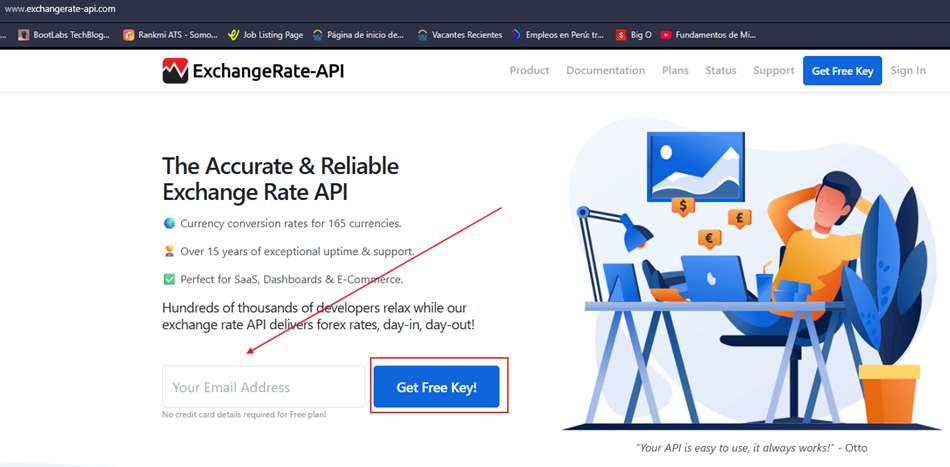
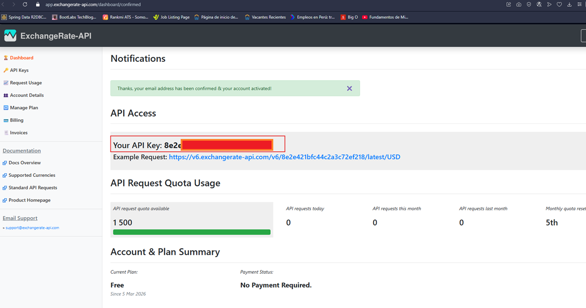

# 4️⃣ Capa de Infraestructura (JPA, MapStruct, RestClient y los controladores)

---

La capa de `infraestructura` es responsable de proveer las `implementaciones concretas de los puertos de salida`
definidos en la capa de aplicación, así como de exponer los `adaptadores de entrada (controladores REST)` que permiten
a clientes externos interactuar con el sistema.

En esta capa encontramos:

- `Persistencia con JPA/Hibernate` → entidades (`@Entity`) que representan tablas y repositorios que implementan los
  puertos de salida.
- `MapStruct` → mappers automáticos para transformar entre entidades JPA y objetos de dominio.
- `RestClient` → clientes HTTP para consumir APIs externas (ej. tipo de cambio).
- `Controladores REST` → adaptadores de entrada que reciben requests HTTP y delegan a los casos de uso de la capa de
  aplicación.

# 👤 Customer

## 👤 Customer – Input Adapter - Request DTOs

- `Uso de record` → los DTOs son inmutables y expresivos, ideales para representar contratos de entrada en la capa de
  infraestructura.
- `Validaciones con Bean Validation (Jakarta Validation)` → las anotaciones como `@NotBlank`, `@Size`, `@Email`,
  `@NotNull` aseguran que los datos recibidos en los endpoints REST cumplen las reglas mínimas antes de llegar a la
  capa de aplicación.
- `Separación clara` → estos DTOs viven en infraestructura porque representan el contrato HTTP (request body),
  no forman parte del dominio ni de la aplicación.
- `Distinción entre creación y actualización` → `CreateCustomerRequest` incluye todos los campos necesarios para
  registrar un cliente nuevo, mientras que `UpdateCustomerRequest` se limita a los campos que pueden modificarse.

````java
public record CreateCustomerRequest(@NotBlank(message = "El número de documento es obligatorio")
                                    @Size(min = 8, max = 20, message = "El número de documento debe tener entre 8 y 20 caracteres")
                                    String documentNumber,

                                    @NotNull(message = "El tipo de documento es obligatorio")
                                    DocumentType documentType,

                                    @NotBlank(message = "El nombre es obligatorio")
                                    @Size(max = 100, message = "El nombre no puede superar los 100 caracteres")
                                    String firstName,

                                    @NotBlank(message = "El apellido es obligatorio")
                                    @Size(max = 100, message = "El apellido no puede superar los 100 caracteres")
                                    String lastName,

                                    @NotBlank(message = "El email es obligatorio")
                                    @Email(message = "El formato del email es inválido")
                                    String email,

                                    @NotBlank(message = "El teléfono es obligatorio")
                                    @Size(max = 20, message = "El teléfono no puede superar los 20 caracteres")
                                    String phone) {
}
````

````java
public record UpdateCustomerRequest(@NotBlank(message = "El nombre es obligatorio")
                                    @Size(max = 100, message = "El nombre no puede superar los 100 caracteres")
                                    String firstName,

                                    @NotBlank(message = "El apellido es obligatorio")
                                    @Size(max = 100, message = "El apellido no puede superar los 100 caracteres")
                                    String lastName,

                                    @NotBlank(message = "El teléfono es obligatorio")
                                    @Size(max = 20, message = "El teléfono no puede superar los 20 caracteres")
                                    String phone) {
}
````

### 💡 Nota importante

Validaciones en infraestructura vs. restricciones en base de datos

- Estas anotaciones validan los datos antes de llegar al dominio.
- Las constraints reales (`NOT NULL`, `UNIQUE`, `CHECK`) siguen estando en la base de datos vía `Flyway`.
- De esta forma, tenemos una doble capa de protección: validación temprana en el request y enforcement definitivo
  en la base de datos.

## 👤 Customer – Input Adapter - RestController

- `Arquitectura hexagonal en acción` → el controlador inyecta directamente las interfaces de los casos de uso
  (`GetAllCustomersUseCase`, `CreateCustomerUseCase`, etc.), no el `CustomerService (implementación)`.
    - Esto asegura que el controlador solo conoce contratos de aplicación, nunca implementaciones concretas.
- `Endpoints RESTful` → cada operación está mapeada a un verbo HTTP estándar:
    - `GET /customers` → listar todos.
    - `GET /customers/{customerCode}` → obtener uno por código.
    - `POST /customers` → crear.
    - `PUT /customers/{customerCode}` → actualizar.
    - `DELETE /customers/{customerCode}` → eliminar.

- `Uso de DTOs de entrada y salida` → el controlador recibe `CreateCustomerRequest` y `UpdateCustomerRequest`,
  y devuelve `CustomerResponse`.
- `Validaciones automáticas` → gracias a `@Valid`, los request DTOs se validan antes de llegar a la capa de aplicación.

````java

@Slf4j
@RequiredArgsConstructor
@RestController
@RequestMapping(path = "/api/{version}/customers", version = "1")
public class CustomerController {

    private final GetAllCustomersUseCase getAllCustomersUseCase;
    private final GetCustomerByIdUseCase getCustomerByIdUseCase;
    private final CreateCustomerUseCase createCustomerUseCase;
    private final UpdateCustomerUseCase updateCustomerUseCase;
    private final DeleteCustomerUseCase deleteCustomerUseCase;

    @GetMapping
    public ResponseEntity<List<CustomerResponse>> getAllCustomers() {
        return ResponseEntity.ok(this.getAllCustomersUseCase.execute());
    }

    @GetMapping(path = "/{customerCode}")
    public ResponseEntity<CustomerResponse> getCustomerByCode(@PathVariable String customerCode) {
        return ResponseEntity.ok(this.getCustomerByIdUseCase.execute(customerCode));
    }

    @PostMapping
    public ResponseEntity<CustomerResponse> createCustomer(@Valid @RequestBody CreateCustomerRequest request) {
        var command = new CreateCustomerCommand(
                request.documentNumber(),
                request.documentType(),
                request.firstName(),
                request.lastName(),
                request.email(),
                request.phone()
        );
        return ResponseEntity
                .status(HttpStatus.CREATED)
                .body(this.createCustomerUseCase.execute(command));
    }

    @PutMapping(path = "/{customerCode}")
    public ResponseEntity<CustomerResponse> updateCustomer(@PathVariable String customerCode,
                                                           @Valid @RequestBody UpdateCustomerRequest request) {
        var command = new UpdateCustomerCommand(
                request.firstName(),
                request.lastName(),
                request.phone()
        );
        return ResponseEntity.ok(this.updateCustomerUseCase.execute(customerCode, command));
    }

    @DeleteMapping(path = "/{customerCode}")
    public ResponseEntity<Void> deleteCustomer(@PathVariable String customerCode) {
        this.deleteCustomerUseCase.executeDelete(customerCode);
        return ResponseEntity.noContent().build();
    }
}
````

### 🎯 Buenas prácticas reflejadas

- `Separación de responsabilidades` → el controlador solo traduce requests HTTP en comandos de aplicación, no contiene
  lógica de negocio.
- `Consistencia con el dominio` → los comandos (`CreateCustomerCommand`, `UpdateCustomerCommand`) encapsulan la
  intención del request y se pasan al caso de uso.
- `Respuestas claras` → se usan `ResponseEntity` con códigos HTTP adecuados (`200 OK`, `201 Created`, `204 No Content`).
- `Logging con @Slf4j` → permite registrar información útil para auditoría y debugging.
- `Versionado de API` →` @RequestMapping(path = "/api/{version}/customers", version = "1")` asegura que la API pueda
  evolucionar sin romper clientes existentes.

### 💡 Nota importante

- `Controlador desacoplado` → el controlador nunca depende de `CustomerService (implementación)`.
- Si mañana cambias la implementación de los casos de uso, el controlador no se ve afectado.
- Esto es la esencia de la arquitectura hexagonal:
  `los adaptadores de entrada solo conocen contratos, no implementaciones`.

## Customer – Output Adapter - Entidad JPA

- `Anotaciones JPA` → `@Entity`, `@Table`, `@Id`, `@GeneratedValue` permiten mapear la clase a la tabla `customers`.
- `Restricciones de columnas` → `nullable = false`, `unique = true`, `length` aseguran integridad y consistencia en la
  base de datos.
- `Enumerados persistidos como texto` → `@Enumerated(EnumType.STRING)` evita problemas de orden en enums y hace más
  legible la base de datos.
- `Timestamps automáticos` → `@CreationTimestamp` y `@UpdateTimestamp` permiten auditar creación y actualización sin
  lógica adicional.

````java

@ToString
@NoArgsConstructor
@AllArgsConstructor
@Builder
@Setter
@Getter
@Entity
@Table(name = "customers")
public class CustomerEntity {
    @Id
    @GeneratedValue(strategy = GenerationType.IDENTITY)
    private Long id;

    @Column(nullable = false, unique = true, length = 20)
    private String customerCode;

    @Column(nullable = false, unique = true, length = 20)
    private String documentNumber;

    @Enumerated(EnumType.STRING)
    @Column(nullable = false, length = 10)
    private DocumentType documentType;

    @Column(nullable = false, length = 100)
    private String firstName;

    @Column(nullable = false, length = 100)
    private String lastName;

    @Column(nullable = false, unique = true, length = 150)
    private String email;

    @Column(nullable = false, length = 20)
    private String phone;

    @Enumerated(EnumType.STRING)
    @Column(nullable = false, length = 20)
    private CustomerStatus status;

    @CreationTimestamp
    @Column(nullable = false, updatable = false)
    private LocalDateTime createdAt;

    @UpdateTimestamp
    @Column(nullable = false)
    private LocalDateTime updatedAt;
}
````

### 🗄️ Gestión del Schema — Flyway + Hibernate validate

En este proyecto la responsabilidad de crear y versionar la estructura de la base de datos recae exclusivamente en
`Flyway`, a través de scripts SQL versionados ubicados en `src/main/resources/db/migration`. `Flyway` ejecuta estos
scripts en orden al arrancar la aplicación y registra cada migración en su tabla interna `flyway_schema_history`.

`Hibernate` se configura con `ddl-auto: validate`, lo que significa que `nunca crea ni modifica la estructura de la BD`.
Su único rol al arrancar es verificar que las tablas y columnas definidas en las entidades JPA existan y sean
compatibles con el schema real de la BD. Si hay inconsistencias, la aplicación falla al inicio con un error claro,
lo cual es el comportamiento correcto en un entorno productivo.

Esta separación de responsabilidades es una práctica estándar en entornos empresariales:

- `Flyway` → responsable del schema `(DDL)`
- `Hibernate` → responsable de las operaciones de datos `(DML)`

### 📌 Comportamiento de `@Column` con `ddl-auto: validate`

La anotación `@Column` en las entidades JPA tiene atributos cuyo comportamiento varía dependiendo de la estrategia
`ddl-auto` configurada. Con `validate`, su comportamiento es el siguiente:

- `nullable = false`. Hibernate valida en `tiempo de ejecución` antes de ejecutar el SQL. Si el valor del campo es
  `null`, Hibernate lanza una `PropertyValueException` sin llegar a la base de datos. Este atributo funciona
  independientemente del `ddl-auto`.

- `unique = true`. Con `ddl-auto: validate`, Hibernate no crea el índice único en la BD
  (con `ddl-auto: create` o `update` sí crearía el índice único automáticamente). Sin embargo, la unicidad
  sí está garantizada porque `Flyway` ya creó el constraint `UNIQUE` correspondiente en el script de migración.
  Si se intenta insertar un valor duplicado, PostgreSQL rechaza el INSERT y Hibernate convierte ese error en una
  `DataIntegrityViolationException`. En la práctica, `unique = true` en la entidad funciona como documentación del
  esquema dentro del código, comunicando la intención al desarrollador.

- `length = 150`. Este atributo solo tiene efecto cuando Hibernate genera el schema automáticamente
  (`ddl-auto: create` o `update`). Con validate es puramente metadata informativa, no realiza ninguna validación
  en runtime. Si se necesita validar la longitud a nivel de aplicación, debe usarse `@Size` de `Bean Validation` en los
  Request DTOs de la capa de infraestructura.

- `updatable = false`. Hibernate `excluye` la columna del `SQL UPDATE` generado en runtime, independientemente del
  `ddl-auto`. Aunque alguien modifique el valor del campo en la entidad JPA, Hibernate nunca lo incluirá en la sentencia
  de actualización. Se usa típicamente en campos como `createdAt` para garantizar su inmutabilidad a nivel de
  aplicación.

## 📑 Customer – Output Adapter - Repositorio

- `Extiende JpaRepository` → hereda métodos CRUD estándar (`findAll`, `findById`, `save`, `delete`, etc.) sin necesidad
  de implementarlos manualmente.
- `Consultas derivadas por convención` → `Spring Data JPA` genera automáticamente las queries a partir de los nombres de
  los métodos (`findByCustomerCode`, `existsByDocumentNumber`, `existsByEmail`).
- `Uso de Optional` → evita `null` en consultas que pueden no devolver resultados, obligando a manejar explícitamente la
  ausencia de datos.
- `Validaciones de unicidad` → los métodos `existsByDocumentNumber` y `existsByEmail` permiten verificar duplicados
  antes de persistir, alineados con las constraints definidas en `Flyway`.

````java
public interface CustomerJpaRepository extends JpaRepository<CustomerEntity, Long> {

    Optional<CustomerEntity> findByCustomerCode(String customerCode);

    boolean existsByDocumentNumber(String documentNumber);

    boolean existsByEmail(String email);
}
````

## 👤 Customer – Output Adapter - MapStruct Mapper

- `Uso de MapStruct` → `@Mapper(componentModel = SPRING)` indica que `MapStruct` generará automáticamente la
  implementación y la registrará como bean de Spring.
- `Dominio → Entidad JPA (toEntity)`
    - Se extraen los valores de los `Value Objects` `(.value())` para mapearlos a tipos primitivos o simples
      (String, Long).
    - Ejemplo: `customer.getCustomerCode().value()` se convierte en `String` para persistencia.
- `Entidad JPA → Dominio (toDomain)`
    - Se usa un método `default` porque `MapStruct` no puede inferir automáticamente cómo reconstruir un objeto de
      dominio con `Value Objects`.
    - Aquí se llama explícitamente a `Customer.reconstitute(...)`, que es el factory method del dominio para
      reconstruir un agregado desde la base de datos.
- `Respeto por el dominio` → el mapper nunca crea un `Customer` con `new`, siempre usa el método de reconstitución
  para mantener las invariantes del dominio.

````java

@Mapper(componentModel = MappingConstants.ComponentModel.SPRING)
public interface CustomerInfraMapper {

    // Convierte dominio → entidad JPA
    // Extraemos el valor de cada Value Object con .value()
    @Mapping(target = "id", expression = "java(customer.getId() != null ? customer.getId().value() : null)")
    @Mapping(target = "customerCode", expression = "java(customer.getCustomerCode().value())")
    @Mapping(target = "documentNumber", expression = "java(customer.getDocumentNumber().value())")
    @Mapping(target = "email", expression = "java(customer.getEmail().value())")
    CustomerEntity toEntity(Customer customer);

    // Convierte entidad JPA → dominio, llamando explícitamente a reconstitute()
    // Mapeamos cada campo explícitamente porque el dominio usa Value Objects
    // y MapStruct no puede inferir la conversión automáticamente.
    // MapStruct respeta los métodos por default en las interfaces y los incluye en el código
    // generado sin intentar sobreescribirlos. Es la forma estándar de manejar casos donde
    // MapStruct no puede inferir el mapeo automáticamente.
    default Customer toDomain(CustomerEntity customerEntity) {
        return Customer.reconstitute(
                customerEntity.getId(),
                customerEntity.getCustomerCode(),
                customerEntity.getDocumentNumber(),
                customerEntity.getDocumentType(),
                customerEntity.getFirstName(),
                customerEntity.getLastName(),
                customerEntity.getEmail(),
                customerEntity.getPhone(),
                customerEntity.getStatus(),
                customerEntity.getCreatedAt(),
                customerEntity.getUpdatedAt()
        );
    }
}
````

### 💡 Nota importante

- `MapStruct + Flyway + ddl-auto: validate` → el mapper asegura que los datos que entran/salen de la base de
  datos (via JPA) se transformen correctamente en objetos de dominio.
- Esto evita que el dominio dependa de anotaciones JPA o de detalles de infraestructura.

## 👤 Customer – Output Adapter - CustomerJpaAdapter

- `Implementa el puerto de salida` → `CustomerJpaAdapter` cumple el contrato de `CustomerRepositoryPort`,
  definido en la capa de aplicación.
- Uso de `CustomerJpaRepository` → delega las operaciones CRUD y consultas específicas a la interfaz de
  `Spring Data JPA`.
- Conversión con `CustomerInfraMapper` → asegura que los datos se transformen correctamente entre `CustomerEntity`
  (infraestructura) y `Customer` (dominio).
- `Anotaciones de Spring` →
    - `@Component` → registra el adapter como bean en el contexto de Spring.
    - `@RequiredArgsConstructor` → inyecta las dependencias (`CustomerJpaRepository`, `CustomerInfraMapper`) vía
      constructor.

````java

@RequiredArgsConstructor
@Component
public class CustomerJpaAdapter implements CustomerRepositoryPort {

    private final CustomerJpaRepository customerJpaRepository;
    private final CustomerInfraMapper customerInfraMapper;

    @Override
    public List<Customer> findAll() {
        return this.customerJpaRepository.findAll()
                .stream()
                .map(this.customerInfraMapper::toDomain)
                .toList();
    }

    @Override
    public Optional<Customer> findById(Long customerId) {
        return this.customerJpaRepository.findById(customerId)
                .map(this.customerInfraMapper::toDomain);
    }

    @Override
    public Optional<Customer> findByCustomerCode(String customerCode) {
        return this.customerJpaRepository.findByCustomerCode(customerCode)
                .map(this.customerInfraMapper::toDomain);
    }

    @Override
    public Customer save(Customer customer) {
        CustomerEntity entity = this.customerInfraMapper.toEntity(customer);
        CustomerEntity savedEntity = this.customerJpaRepository.save(entity);
        return this.customerInfraMapper.toDomain(savedEntity);
    }

    @Override
    public boolean existsByDocumentNumber(String documentNumber) {
        return this.customerJpaRepository.existsByDocumentNumber(documentNumber);
    }

    @Override
    public boolean existsByEmail(String email) {
        return this.customerJpaRepository.existsByEmail(email);
    }
}
````

# 💳 Account

## 💳 Account – Input Adapter - Request DTOs

- `Uso de record en Java` → garantiza inmutabilidad y simplicidad en la definición de DTOs. Son ideales para
  representar datos de entrada en APIs REST.
- `Validaciones con Bean Validation (Jakarta Validation)` → las anotaciones (`@NotNull`, `@DecimalMin`, `@Digits`,
  `@Size`, `@Email`) aseguran que los datos cumplen reglas mínimas antes de llegar a la capa de aplicación.
- `Separación de responsabilidades` → estos DTOs viven en la capa de infraestructura porque representan el contrato
  HTTP (request body), no forman parte del dominio ni de la aplicación.
- `Orientación a casos de uso específicos` → cada DTO corresponde a una operación concreta: abrir cuenta, depositar,
  retirar.

````java
public record OpenAccountRequest(@NotNull(message = "El tipo de cuenta es obligatorio")
                                 AccountType accountType,

                                 @NotNull(message = "El saldo inicial es obligatorio")
                                 @DecimalMin(value = "0.01", message = "El saldo inicial debe ser mayor a cero")
                                 @Digits(integer = 17, fraction = 2, message = "El saldo debe tener máximo 2 decimales")
                                 BigDecimal initialBalance,

                                 @NotNull(message = "La moneda es obligatoria")
                                 Currency currency) {
}
````

````java
public record DepositRequest(@NotNull(message = "El monto es obligatorio")
                             @DecimalMin(value = "0.01", message = "El monto debe ser mayor a cero")
                             @Digits(integer = 17, fraction = 2, message = "El monto debe tener máximo 2 decimales")
                             BigDecimal amount,

                             @Size(max = 255, message = "La descripción no puede superar los 255 caracteres")
                             String description) {
}
````

````java
public record WithdrawRequest(@NotNull(message = "El monto es obligatorio")
                              @DecimalMin(value = "0.01", message = "El monto debe ser mayor a cero")
                              @Digits(integer = 17, fraction = 2, message = "El monto debe tener máximo 2 decimales")
                              BigDecimal amount,

                              @Size(max = 255, message = "La descripción no puede superar los 255 caracteres")
                              String description) {
}
````

### 🎯 Buenas prácticas reflejadas

- `Validaciones tempranas` → los errores se detectan antes de llegar al dominio, reduciendo riesgos.
- `Consistencia con restricciones de base de datos` → las validaciones reflejan las mismas reglas que definimos en
  Flyway y en las entidades JPA.
- `Principio de responsabilidad única` → cada DTO representa solo datos de entrada, sin lógica de negocio ni
  persistencia.
- `Doble capa de protección` → validaciones en DTOs + constraints definitivas en la base de datos.

## 💳 Account – Input Adapter - RestController

- `Arquitectura hexagonal en acción` → el controlador inyecta directamente las `interfaces de casos de uso` (
  `GetAccountsByCustomerUseCase`, `DepositUseCase`, etc.), nunca el `AccountService (implementación)`.
    - Esto asegura que el controlador solo conoce contratos de aplicación, no implementaciones concretas.
- `Endpoints RESTful` → cada operación está mapeada a un verbo HTTP estándar:
    - `GET /customers/{customerCode}` → listar cuentas de un cliente.
    - `GET /{accountNumber}` → obtener detalles de una cuenta.
    - `GET /{accountNumber}/balance` → consultar saldo.
    - `POST /` → abrir cuenta.
    - `POST /{accountNumber}/deposit` → realizar depósito.
    - `POST /{accountNumber}/withdraw` → realizar retiro.
    - `PATCH /{accountNumber}/block` → bloquear cuenta.
- `Uso de DTOs y comandos` → el controlador recibe DTOs (`OpenAccountRequest`, `DepositRequest`, `WithdrawRequest`)
  y los traduce en comandos (`OpenAccountCommand`, `DepositCommand`, `WithdrawCommand`) que se pasan a los casos de uso.
- `Validaciones automáticas` → gracias a `@Valid`, los request DTOs se validan antes de llegar a la capa de aplicación.

````java

@Slf4j
@RequiredArgsConstructor
@RestController
@RequestMapping(path = "/api/{version}/accounts", version = "1")
public class AccountController {

    private final GetAccountsByCustomerUseCase getAccountsByCustomerUseCase;
    private final GetAccountByIdUseCase getAccountByIdUseCase;
    private final GetAccountBalanceUseCase getAccountBalanceUseCase;
    private final OpenAccountUserCase openAccountUserCase;
    private final DepositUseCase depositUseCase;
    private final WithdrawUseCase withdrawUseCase;
    private final BlockAccountUseCase blockAccountUseCase;

    @GetMapping(path = "/customers/{customerCode}")
    public ResponseEntity<List<AccountResponse>> getAllAccounts(@PathVariable String customerCode) {
        return ResponseEntity.ok(this.getAccountsByCustomerUseCase.executeAccountsByCustomer(customerCode));
    }

    @GetMapping(path = "/{accountNumber}")
    public ResponseEntity<AccountResponse> getAccount(@PathVariable String accountNumber) {
        return ResponseEntity.ok(this.getAccountByIdUseCase.execute(accountNumber));
    }

    @GetMapping(path = "/{accountNumber}/balance")
    public ResponseEntity<AccountBalanceResponse> getBalance(@PathVariable String accountNumber) {
        return ResponseEntity.ok(this.getAccountBalanceUseCase.executeGetBalance(accountNumber));
    }

    @PostMapping
    public ResponseEntity<AccountResponse> openAccount(@RequestParam String customerCode,
                                                       @Valid @RequestBody OpenAccountRequest request) {
        var command = new OpenAccountCommand(
                customerCode,
                request.accountType(),
                request.initialBalance(),
                request.currency()
        );
        return ResponseEntity
                .status(HttpStatus.CREATED)
                .body(this.openAccountUserCase.execute(command));
    }

    @PostMapping(path = "/{accountNumber}/deposit")
    public ResponseEntity<AccountResponse> deposit(@PathVariable String accountNumber,
                                                   @Valid @RequestBody DepositRequest request) {
        var command = new DepositCommand(request.amount(), request.description());
        return ResponseEntity.ok(this.depositUseCase.execute(accountNumber, command));
    }

    @PostMapping(path = "/{accountNumber}/withdraw")
    public ResponseEntity<AccountResponse> withdraw(@PathVariable String accountNumber,
                                                    @Valid @RequestBody WithdrawRequest request) {
        var command = new WithdrawCommand(request.amount(), request.description());
        return ResponseEntity.ok(this.withdrawUseCase.execute(accountNumber, command));
    }

    @PatchMapping(path = "/{accountNumber}/block")
    public ResponseEntity<Void> blockAccount(@PathVariable String accountNumber) {
        this.blockAccountUseCase.executeBlock(accountNumber);
        return ResponseEntity.noContent().build();
    }
}
````

## 💳 Account – Output Adapter - Entidad JPA

- `Entidad JPA (@Entity)` → `AccountEntity` mapea la tabla `accounts` en la base de datos.
- `Separación respecto al dominio` → en el dominio, el saldo y la moneda están encapsulados en el
  `Value Object` `Money`. En infraestructura, se almacenan como campos separados `(balance y currency)`.
  El mapper se encarga de ensamblar y desensamblar ese VO.
- `Desacoplamiento entre features` → en lugar de usar `@ManyToOne` hacia `CustomerEntity`, se almacena solo el
  `customerId`. Esto evita dependencias directas entre features y mantiene la independencia de cada vertical slice.
- `Enumerados persistidos como texto` → `@Enumerated(EnumType.STRING)` asegura que los valores de `AccountType`,
  `Currency` y `AccountStatus` se guarden como cadenas legibles, evitando problemas si cambia el orden de los enums.
- `Auditoría automática` → `@CreationTimestamp` y `@UpdateTimestamp` permiten registrar fechas de creación y
  actualización sin lógica adicional.

````java

@ToString
@NoArgsConstructor
@AllArgsConstructor
@Builder
@Setter
@Getter
@Entity
@Table(name = "accounts")
public class AccountEntity {
    @Id
    @GeneratedValue(strategy = GenerationType.IDENTITY)
    private Long id;

    @Column(nullable = false, unique = true, length = 20)
    private String accountNumber;

    // Solo almacenamos el ID del cliente, sin @ManyToOne
    // para mantener el desacoplamiento entre features
    @Column(nullable = false)
    private Long customerId;

    @Enumerated(EnumType.STRING)
    @Column(nullable = false, length = 20)
    private AccountType accountType;

    @Column(nullable = false, precision = 19, scale = 2)
    private BigDecimal balance;

    @Enumerated(EnumType.STRING)
    @Column(nullable = false, length = 3)
    private Currency currency;

    @Enumerated(EnumType.STRING)
    @Column(nullable = false, length = 20)
    private AccountStatus status;

    @CreationTimestamp
    @Column(nullable = false, updatable = false)
    private LocalDateTime createdAt;

    @UpdateTimestamp
    @Column(nullable = false)
    private LocalDateTime updatedAt;
}
````

## 💳 Account – Output Adapter - Repositorio

- `Extiende JpaRepository` → hereda métodos CRUD estándar (`findAll`, `findById`, `save`, `delete`, etc.), evitando
  implementaciones manuales.
- `Consultas derivadas por convención` → `Spring Data JPA` genera automáticamente las queries a partir de los nombres de
  los métodos (`findByCustomerId`, `findByAccountNumber`, `countByCustomerIdAndStatus`).
- `Uso de Optional` → evita `null` en consultas que pueden no devolver resultados, obligando a manejar explícitamente la
  ausencia de datos.
- `Reglas de negocio reflejadas en queries` → el método `countByCustomerIdAndStatus` permite validar el límite de
  cuentas activas por cliente (ej. máximo 3 cuentas), alineado con la lógica bancaria.

````java
public interface AccountJpaRepository extends JpaRepository<AccountEntity, Long> {
    List<AccountEntity> findByCustomerId(Long customerId);

    Optional<AccountEntity> findByAccountNumber(String accountNumber);

    // Contamos solo las cuentas activas para validar el límite de 3
    int countByCustomerIdAndStatus(Long customerId, AccountStatus status);
}
````

## 💳 Account – Output Adapter - MapStruct Mapper

- `Uso de MapStruct` → `@Mapper(componentModel = SPRING)` indica que `MapStruct` generará automáticamente la
  implementación y la registrará como bean de Spring.
- `Dominio → Entidad JPA (toEntity)`
    - El `Value Object` `Money` se desensambla en dos campos separados: `balance` y `currency`.
    - Se extraen los valores de los `Value Objects` (`.value()`, `.amount()`, `.currency()`) para mapearlos a tipos
      simples (`String`, `BigDecimal`, `Enum`).
- `Entidad JPA → Dominio (toDomain)`
    - Se usa un método `default` porque `MapStruct` no puede inferir automáticamente cómo reconstruir un objeto de
      dominio con `Value Objects`.
    - Aquí se llama explícitamente a `Account.reconstitute(...)`, que es el factory method del dominio para reconstruir
      un agregado desde la base de datos.
    - El `Value Object` `Money` se ensambla a partir de los campos separados `balance` y `currency`.

````java

@Mapper(componentModel = MappingConstants.ComponentModel.SPRING)
public interface AccountInfraMapper {

    // Convierte dominio → entidad JPA
    // Money se desensambla en dos campos separados: balance y currency
    @Mapping(target = "id", expression = "java(account.getId() != null ? account.getId().value() : null)")
    @Mapping(target = "accountNumber", expression = "java(account.getAccountNumber().value())")
    @Mapping(target = "balance", expression = "java(account.getBalance().amount())")
    @Mapping(target = "currency", expression = "java(account.getBalance().currency())")
    AccountEntity toEntity(Account account);

    // Convierte entidad JPA → dominio llamando explícitamente a reconstitute()
    // Money se ensambla desde los campos separados balance y currency
    default Account toDomain(AccountEntity entity) {
        return Account.reconstitute(
                entity.getId(),
                entity.getAccountNumber(),
                entity.getCustomerId(),
                entity.getAccountType(),
                Money.of(entity.getBalance(), entity.getCurrency()),
                entity.getStatus(),
                entity.getCreatedAt(),
                entity.getUpdatedAt()
        );
    }
}
````

## 💳 Account – Output Adapter - AccountJpaAdapter

- `Adapter de salida` → este componente implementa el puerto `AccountRepositoryPort` definido en la capa de aplicación.
- `Inyección de dependencias` → recibe el `AccountJpaRepository` y el `AccountInfraMapper` mediante constructor (
  `@RequiredArgsConstructor`).
- `Conversión entre capas` →
    - Al guardar `(save)`, convierte el objeto de dominio `Account` en `AccountEntity` con el mapper.
    - Al recuperar (`findById`, `findByAccountNumber`, `findByCustomerId`), convierte la entidad JPA en objeto de
      dominio con el mapper.
- `Reglas de negocio reflejadas` → el método `countActiveAccountsByCustomerId` permite validar el límite de cuentas
  activas por cliente, apoyando la lógica de negocio en la capa de aplicación.

````java

@RequiredArgsConstructor
@Component
public class AccountJpaAdapter implements AccountRepositoryPort {

    private final AccountJpaRepository accountJpaRepository;
    private final AccountInfraMapper accountInfraMapper;

    @Override
    public List<Account> findByCustomerId(Long customerId) {
        return this.accountJpaRepository.findByCustomerId(customerId)
                .stream()
                .map(this.accountInfraMapper::toDomain)
                .toList();
    }

    @Override
    public Optional<Account> findById(Long accountId) {
        return this.accountJpaRepository.findById(accountId)
                .map(this.accountInfraMapper::toDomain);
    }

    @Override
    public Optional<Account> findByAccountNumber(String accountNumber) {
        return this.accountJpaRepository.findByAccountNumber(accountNumber)
                .map(this.accountInfraMapper::toDomain);
    }

    @Override
    public Account save(Account account) {
        AccountEntity entity = this.accountInfraMapper.toEntity(account);
        AccountEntity savedEntity = this.accountJpaRepository.save(entity);
        return this.accountInfraMapper.toDomain(savedEntity);
    }

    @Override
    public int countActiveAccountsByCustomerId(Long customerId) {
        return this.accountJpaRepository.countByCustomerIdAndStatus(customerId, AccountStatus.ACTIVE);
    }
}
````

### 🎯 Buenas prácticas reflejadas

- `Hexagonal en acción` → la capa de aplicación depende del puerto (`AccountRepositoryPort`), y la infraestructura
  provee esta implementación.
- `Separación de responsabilidades` → el adapter no contiene lógica de negocio, solo delega en el repositorio y el
  mapper.
- `Consistencia con el dominio` → gracias al mapper, el dominio nunca depende de JPA ni de anotaciones de
  infraestructura.
- `Uso de Optional y colecciones` → se manejan correctamente los casos donde no hay resultados, evitando `null`.
- `Homogeneidad` → mantiene el mismo patrón que vimos en `CustomerJpaAdapter`, reforzando la consistencia del proyecto.

## 💳 Account – Output Adapter - RestClient Config

Antes de implementar el `RestClientConfig` vamos a generar el `API Key` que necesitamos para hacer peticiones al
servicio externo `ExchangeRate-API`.

Para eso, simplemente nos registramos nos creamos una cuenta en https://www.exchangerate-api.com:



Luego, inmediatamente al confirmar el enlace de activación que se envía a nuestro correo, podremos ver que nos genera
automáticamente el `API Key`.



Ahora que ya tenemos el `API Key`, nos vamos a nuestro `application.yml` y lo agregamos en la propiedad de
configuración personalizada.

````yml
# ===== Configuración personalizada del servicio externo (ExchangeRate API) =====
exchange-rate:
  api:
    base-url: https://v6.exchangerate-api.com/v6
    api-key: 8e2e421bfc44c2a3c72ef218
    timeout-seconds: 5
````

### 🌐 Configuración del RestClient — `JdkClientHttpRequestFactory`

#### ¿Por qué Spring recomienda definir explícitamente un RequestFactory?

A partir de `Spring Framework 6` y `Spring Boot 3`, se recomienda definir explícitamente una implementación
de `ClientHttpRequestFactory` al construir un `RestClient`. La razón es que sin una configuración explícita,
Spring usa una implementación por defecto que puede variar según las dependencias disponibles en el classpath,
lo que hace el comportamiento impredecible entre entornos. Además, sin un `RequestFactory` explícito,
no es posible configurar `timeouts`, lo que en un entorno productivo es inaceptable:
una llamada a una API externa sin timeout puede bloquear un hilo indefinidamente y degradar toda la aplicación.

#### ¿Por qué elegimos `JdkClientHttpRequestFactory`?

Existen varias implementaciones disponibles:

| Implementación                           | Basada en                                | Recomendado para                             |
|------------------------------------------|------------------------------------------|----------------------------------------------|
| `SimpleClientHttpRequestFactory`         | `HttpURLConnection` (API legacy de Java) | Proyectos legacy o compatibilidad con Java 8 |
| `HttpComponentsClientHttpRequestFactory` | Apache HttpClient                        | Proyectos que ya usan Apache HttpClient      |
| `JdkClientHttpRequestFactory`            | `java.net.http.HttpClient` (Java 11+)    | Proyectos modernos con Java 11 o superio     |

En nuestro caso usamos `JdkClientHttpRequestFactory` porque:

- Nuestro proyecto usa `Java 25`, por lo que tenemos disponible el `HttpClient` nativo de Java sin ninguna dependencia
  adicional.
- Es la implementación `más moderna y eficiente` al estar construida sobre el `HttpClient` introducido en Java 11,
  diseñado para ser asíncrono y de alto rendimiento.
- `No requiere dependencias externas` como Apache HttpClient, manteniendo el proyecto más ligero.
- Es la opción que `Spring Boot recomienda` para proyectos nuevos con Java moderno.

#### Configuración de timeouts

`JdkClientHttpRequestFactory` gestiona los timeouts en dos niveles:

| Timeout          | ¿Dónde se configura?                | ¿Qué controla?                                                          |
|------------------|-------------------------------------|-------------------------------------------------------------------------|
| `connectTimeout` | En el `HttpClient` builder          | Tiempo máximo para establecer la conexión con el servidor externo       |
| `readTimeout`    | En el `JdkClientHttpRequestFactory` | Tiempo máximo para recibir la respuesta una vez establecida la conexión |

Ambos timeouts son esenciales en un entorno bancario productivo donde una API externa lenta o caída no debe impactar la
disponibilidad del servicio principal.

````java

@Configuration
public class RestClientConfig {

    @Value("${exchange-rate.api.base-url}")
    private String baseUrl;

    @Value("${exchange-rate.api.api-key}")
    private String apiKey;

    @Value("${exchange-rate.api.timeout-seconds}")
    private int timeoutSeconds;

    @Bean
    public RestClient exchangeRateRestClient() {
        HttpClient httpClient = HttpClient.newBuilder()
                .connectTimeout(Duration.ofSeconds(this.timeoutSeconds)) // timeout de conexión
                .build();

        JdkClientHttpRequestFactory factory = new JdkClientHttpRequestFactory(httpClient);
        factory.setReadTimeout(Duration.ofSeconds(this.timeoutSeconds));        // timeout de lectura

        return RestClient.builder()
                .baseUrl(String.format("%s/%s", this.baseUrl, apiKey))
                .requestFactory(factory) //Cambio importante a partir de Spring Boot 3.4.x porque es ahí donde se consolida y se vuelve una recomendación oficial y más necesaria
                .defaultHeader("Accept", "application/json")
                .build();
    }
}
````

### 💡 Nota importante

- `Arquitectura hexagonal` → este cliente es un adaptador de salida:
    - La capa de aplicación define un puerto (ej. `ExchangeRatePort`).
    - La infraestructura provee esta implementación (`RestClientConfig` + cliente concreto).
- `Gestión del API Key` → en entornos productivos, el `API Key` debería almacenarse en un gestor seguro de secretos
  (ej. Vault, AWS Secrets Manager), no directamente en `application.yml`.

## ⚠️ Shared – Exception

La excepción `ExchangeRateUnavailableException` vive en `shared/exception/` porque es transversal, no pertenece
a ninguna feature en particular.

````java
public class ExchangeRateUnavailableException extends RuntimeException {
    public ExchangeRateUnavailableException(String baseCurrency, String targetCurrency) {
        super("No se pudo obtener el tipo de cambio para el par %s/%s. Intente nuevamente más tarde."
                .formatted(baseCurrency, targetCurrency));
    }
}
````

## 💳 Account – Output Adapter (Rest DTO)

- `Uso de record en Java` → garantiza inmutabilidad y simplicidad en la definición del DTO. Ideal para representar
  respuestas externas.
- `Mapeo con Jackson (@JsonProperty)` → asegura que los nombres de los campos en JSON (`base_code`, `target_code`,
  `conversion_rate`) se mapeen correctamente a las propiedades del DTO.
- `Campos principales de la respuesta`:
    - `result` → estado de la petición (ej. "success" o "error").
    - `baseCode` → moneda base de la conversión.
    - `targetCode` → moneda destino.
    - `conversionRate` → tasa de conversión entre las dos monedas.

````java
public record ExchangeRateApiResponse(String result,

                                      @JsonProperty("base_code")
                                      String baseCode,

                                      @JsonProperty("target_code")
                                      String targetCode,

                                      @JsonProperty("conversion_rate")
                                      BigDecimal conversionRate) {
}
````

### 💡 Nota importante

- `Arquitectura hexagonal` → este DTO es parte del adaptador de salida:
    - La infraestructura recibe la respuesta externa en formato JSON.
    - El DTO la traduce a un objeto Java que puede ser usado por el `ExchangeRateRestClientAdapter`.
- `Resiliencia` → si el campo result indica error, la aplicación puede lanzar la excepción
  `ExchangeRateUnavailableException` que ya definimos.

## 💳 Account – Output Adapter (Rest)

- `Implementación del puerto (ExchangeRatePort)` → este adapter cumple el contrato definido en la capa de aplicación,
  permitiendo consultar tasas de cambio externas.
- `Uso de RestClient` → se inyecta el cliente configurado en `RestClientConfig`, que ya contiene el `baseUrl`, `apiKey`
  y `timeout`.
- `Consumo de API externa` →
    - Se construye la URI dinámica `/pair/{base}/{target}` para consultar el tipo de cambio entre dos monedas.
    - Se deserializa la respuesta JSON en el DTO `ExchangeRateApiResponse`.
- `Validación de respuesta` → si la respuesta es nula o el campo result no es "success", se lanza la excepción
  personalizada `ExchangeRateUnavailableException`.
- `Manejo de errores` → cualquier `RestClientException` se captura, se registra en logs y se transforma en una
  excepción (`ExchangeRateUnavailableException`).

````java

@Slf4j
@RequiredArgsConstructor
@Component
public class ExchangeRateRestClientAdapter implements ExchangeRatePort {

    private final RestClient exchangeRateRestClient;

    @Override
    public BigDecimal getExchangeRate(String baseCurrency, String targetCurrency) {

        try {
            ExchangeRateApiResponse response = this.exchangeRateRestClient
                    .get()
                    .uri("/pair/{base}/{target}", baseCurrency, targetCurrency)
                    .retrieve()
                    .body(ExchangeRateApiResponse.class);

            if (Objects.isNull(response) || !"success".equals(response.result())) {
                throw new ExchangeRateUnavailableException(baseCurrency, targetCurrency);
            }

            return response.conversionRate();

        } catch (RestClientException e) {
            log.error("Error al consultar tipo de cambio {}/{}: {}", baseCurrency, targetCurrency, e.getMessage());
            throw new ExchangeRateUnavailableException(baseCurrency, targetCurrency);
        }
    }
}
````
